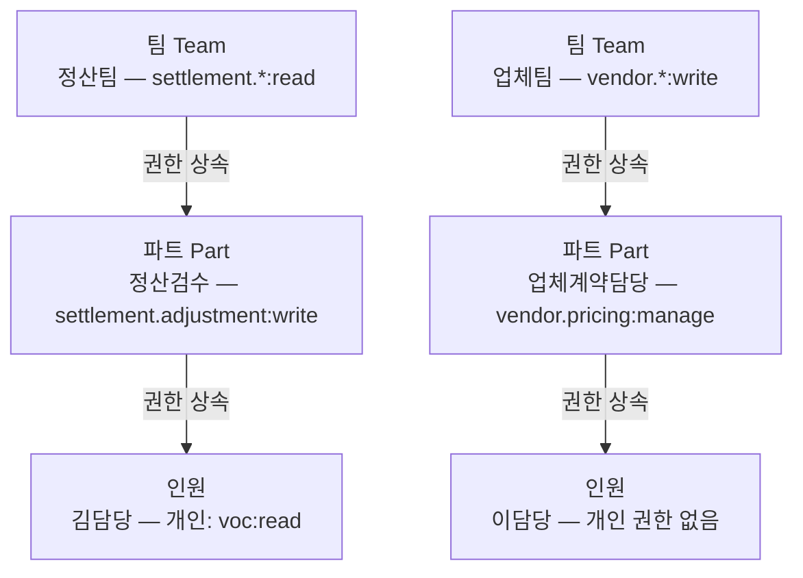

# 어드민 RBAC 설계 — 3계층 조직에 권한을 입히는 법

구글 시트의 권한 모델은 두 가지다. 편집자, 뷰어. 처음엔 충분해 보인다.

팀이 생기고 업무가 나뉘기 시작하면 균열이 온다. 정산팀이 업체 연락처까지 보이는 게 불편하다고 한다. 특정 담당자는 담당 업체 데이터만 수정해야 하는데 전체 시트에 접근한다. VOC 처리 인원이 정산 데이터를 실수로 건드렸다.

어드민으로 전환하면서 권한 모델을 새로 짰다. 조직 구조가 팀·파트·인원 3계층이었고, 도메인이 정산·업체·VOC·사용자 등으로 세분화돼 있었다. 이 두 가지를 어떻게 엮을지가 핵심 문제였다.

## 역할(Role) 기반을 안 쓴 이유

처음 생각은 역할 기반이었다. "정산팀장", "업체담당자", "VOC처리자" 같은 역할을 만들고 권한 목록을 매핑하는 방식. 깔끔하고 직관적이다.

운영 1주 만에 예외가 생겼다. "정산팀장인데 VOC는 읽기만 해야 한다." 역할에 예외를 추가하거나 역할을 새로 만들어야 한다. 예외가 쌓일수록 역할 수가 조직 구조 × 도메인 수만큼 불어난다.

`resource:operation` scope 방식을 택했다. 권한을 "어떤 도메인에 어떤 수준" 단위로 쪼갠다. 역할 추가 없이 개인 scope 조정으로 예외를 처리할 수 있다.

## 조직 구조: 팀·파트·인원 3계층

권한이 사람마다 다 다르면 관리가 안 된다. 조직 구조를 그대로 반영했다.



팀 레벨에서 공통 권한을 관리하고, 파트가 업무 특성에 맞게 좁히거나 더한다. 인원은 개인 업무에 필요한 예외를 직접 가진다. 팀 권한을 바꾸면 하위 전체에 반영된다.

코드에서 이 3계층은 `UserGroupType`으로 `TEAM`과 `ROLE`로 표현했다. 팀과 파트 모두 그룹으로 표현하고, 그 안에서 `OWNER`/`ADMIN`/`USER`로 멤버 역할을 구분했다.

```typescript
export enum UserGroupType {
  TEAM = 'TEAM',
  ROLE = 'ROLE',  // 팀 안의 파트
}

export enum UserGroupUserType {
  OWNER = 'OWNER',   // 그룹 권한 관리 가능
  ADMIN = 'ADMIN',   // 멤버 승인/반려
  USER = 'USER',
}
```

## 도메인별 NONE/READ/WRITE/MANAGE 4단계

각 도메인마다 권한 수준을 4단계로 나눴다.

| 단계 | 설명 |
|------|------|
| **NONE** | 접근 없음 |
| **READ** | 조회만 |
| **WRITE** | 생성, 수정 포함 |
| **MANAGE** | 삭제 포함 전체 관리 |

실제 코드에는 `MANAGE` 위에 `ADMIN` tier가 하나 더 있다. 해당 도메인의 권한 부여/회수 자체를 제어하는 관리자용 수준이다. 일반 업무 흐름에서는 MANAGE까지가 최상위고, `user.privilege:admin`처럼 권한 관리 기능 접근에만 쓰인다.

```typescript
export const PRIVILEGE_OPERATIONS = ['admin', 'manage', 'write', 'read'] as const;

export enum PrivilegeOperationTier {
  ADMIN,   // 0 — 권한 부여/회수 포함
  MANAGE,  // 1 — 삭제 포함 (이력서 MANAGE)
  WRITE,   // 2 — 생성/수정 (이력서 WRITE)
  READ,    // 3 — 조회만 (이력서 READ)
  // 권한 없음 = 해당 resource scope 자체가 없음 (이력서 NONE)
}
```

`NONE`은 별도 값이 아니라 해당 리소스 scope 자체가 없는 상태다. scope 문자열에 `voc:read`가 없으면 VOC 접근은 NONE이다.

## 도메인 리소스 목록

처음엔 도메인을 굵직하게 잡으려 했다. `settlement`, `vendor`, `voc`. 그런데 "정산은 전체 보되 정산 조정 건은 읽기만 해야 한다"는 요구사항이 나왔다. 같은 도메인 안에서도 쪼개야 했다.

결국 14개 리소스로 세분화했다.

```typescript
export enum PrivilegeResource {
  VOC = 'voc',
  SETTLEMENT_SETTLEMENT = 'settlement.settlement',
  SETTLEMENT_ADJUSTMENT = 'settlement.adjustment',
  SETTLEMENT_VENDOR = 'settlement.vendor',
  VENDOR_VENDOR = 'vendor.vendor',
  VENDOR_PRICING = 'vendor.pricing',
  USER_PRIVILEGE = 'user.privilege',
  USER_MEMBER = 'user.member',
  // ... 총 14개
}
```

scope 형식은 `resource:operation`이다.

```typescript
export type TAuthScope = `${PrivilegeResource}:${PrivilegeOperation}`;
// 예: 'vendor.vendor:write', 'settlement.adjustment:read', 'user.privilege:admin'
```

## 권한 상속: union 합산

유저의 실제 권한은 개인 권한과 소속 그룹 권한의 합집합이다.

```typescript
// User.ts
get privilegesIncludingInherited(): Privilege[] {
  const userPrivileges = this.props.privileges;
  const groupPrivileges = this.props.groups.map((g) => g.privileges).flat();
  return Privileges.union(userPrivileges, groupPrivileges);
}
```

`Privileges.union`은 같은 리소스에 대해 더 높은 tier(낮은 숫자)를 선택한다. 팀이 `vendor.vendor:read`를 가지고 개인이 `vendor.vendor:write`를 가지면 `write`가 최종이다.

tier 비교는 숫자 크기로 결정된다. `MANAGE(1) <= WRITE(2)`면 false, `WRITE(2) <= MANAGE(1)`면 false. "요청된 권한 이상을 가지고 있는가"를 판단하는 `isEqualOrHigher`가 핵심이다.

```typescript
export class Privilege {
  isEqualOrHigher(other: Privilege): boolean {
    // operationTier 숫자가 낮을수록 높은 권한
    return this.isSameResource(other) && this.operationTier <= other.operationTier;
  }
}
```

## JWT에 scope를 담는 이유

권한 체크가 모든 API 요청에 붙는다. 매번 DB를 조회하면 레이턴시가 무시할 수 없다.

JWT 발급 시점에 상속 포함 전체 scope를 계산해서 토큰에 넣는다.

```typescript
// User.ts
issueJWTToken(): string {
  return jwt.sign({
    username, id, email, isApproved,
    scope: this.privilegesIncludingInherited
      .map(p => p.scope)
      .join(' '),
  }, config.JWT_SECRET, { expiresIn: '1d' });
}
```

scope는 공백 구분 문자열이다. `'vendor.vendor:write settlement.settlement:read user.privilege:admin'` 형태.

Guard에서 이 문자열을 파싱해서 비교한다.

```typescript
export class PrivilegeScopeGuard implements CanActivate {
  canActivate(context: ExecutionContext): boolean {
    const scope = this.reflector.get(PrivilegeScope, context.getHandler());
    const requiredPrivilege = Privilege.create(scope);
    const userPayload = request.user as InternalJwtPayload;
    return this.hasPrivilege(requiredPrivilege, userPayload.scope);
  }

  private hasPrivilege(required: Privilege, userScope: string): boolean {
    const userPrivileges = userScope.split(' ').map(s => Privilege.create(s));
    return userPrivileges.some(p => p.isEqualOrHigher(required));
  }
}
```

컨트롤러에서는 데코레이터 하나로 끝난다.

```typescript
@Post('users/:id/privileges')
@UseAuthenticationGuard({ requiredScope: 'user.privilege:write' })
async grantPrivileges(...) { ... }
```

## 권한 요청·승인 워크플로우

권한이 필요한 사람이 직접 신청하고, 그룹 OWNER/ADMIN이 Slack에서 승인하거나 반려한다. admin이 모든 권한 부여를 직접 처리하면 병목이 생기기 때문이다.

```typescript
export enum UserPrivilegeRequestStatus {
  REQUESTED = 'REQUESTED',
  APPROVED = 'APPROVED',
  REJECTED = 'REJECTED',
  DISMISSED = 'DISMISSED',  // 다른 권한 변경으로 자동 종료
}
```

`DISMISSED`가 좀 특이한 케이스다. `vendor.vendor:read`를 신청한 상태에서 관리자가 직접 `vendor.vendor:write`를 부여하면 기존 신청은 자동 DISMISSED된다. 더 높은 권한이 이미 부여됐으니 신청 자체가 의미 없어진 것이다.

권한 수정 권한도 scope로 제어된다.

- `user.privilege:admin`이면 모든 리소스 권한 관리 가능
- 특정 리소스 `admin`이면 해당 리소스 권한만
- GRANT/PROMOTE는 admin만 가능
- REVOKE는 self-revoke 가능
- DEMOTE는 본인을 현재보다 낮은 tier로만 강등 가능

---

## DB 구조와 감사 이력

구글 시트에서 가장 아쉬웠던 건 변경 이력이 없다는 거였다. 셀이 언제 누구에 의해 바뀌었는지 알 방법이 없다.

```sql
admin_user_privilege_grant_history (
  aupgh_index,
  aupgh_au_index,   -- 대상 유저
  aupgh_type,       -- GRANT/REVOKE/PROMOTE/DEMOTE
  aupgh_resource,
  aupgh_operation
)
```

GRANT/REVOKE만 있는 게 아니라 PROMOTE/DEMOTE를 분리했다. 권한이 있는 상태에서 tier가 바뀌는 건 의미가 다르다. "새로 줬다"와 "올렸다"는 감사 관점에서 다른 사건이다.

`admin_user_privilege` 테이블에 `aup_is_granted` 컬럼도 있다. 권한을 삭제하는 게 아니라 `false`로 표시한다. 이력 추적과 명시적 deny 가능성을 열어둔 구조다.

---

## 아직 부족한 것들

scope가 JWT에 박혀 있어서 권한이 바뀌어도 토큰 만료 전까지 반영이 안 된다. 지금은 만료 시간 1일이라 최대 하루 동안 이전 권한으로 동작할 수 있다. 권한 회수가 즉시 적용돼야 하는 케이스에서 문제다. Redis 블랙리스트나 짧은 만료 + refresh token 방식이 필요하다.

리소스가 14개인데 더 늘어나면 scope 문자열이 길어진다. JWT 페이로드 크기도 커지고 매 요청마다 파싱 비용도 늘어난다. 30개 넘어가면 다른 방식을 고민해야 한다.

명시적 deny가 없다. A 그룹이 `vendor.vendor:write`를 주고 B 그룹이 `vendor.vendor:read`를 주면 `write`가 적용된다. "B 그룹 소속이면 vendor 쓰기를 막아야 한다"는 요구사항이 생기면 현재 구조로는 처리가 안 된다.

권한 요청 DISMISSED 시 신청자에게 알림이 가지 않는다. 본인 신청이 왜 DISMISSED됐는지 모른다. Slack 알림 연동이 필요하다.
