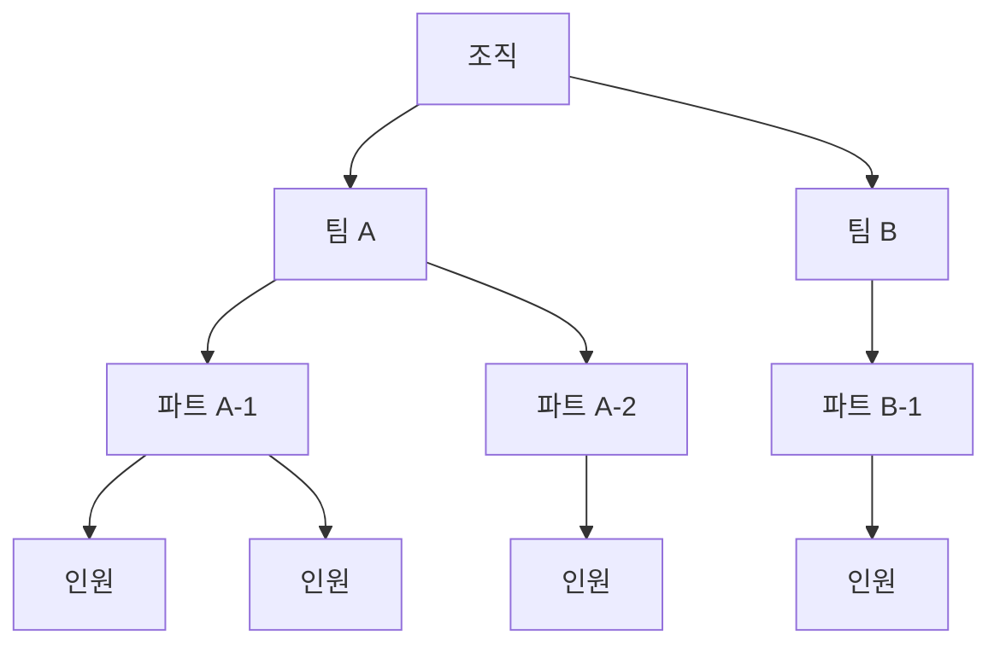
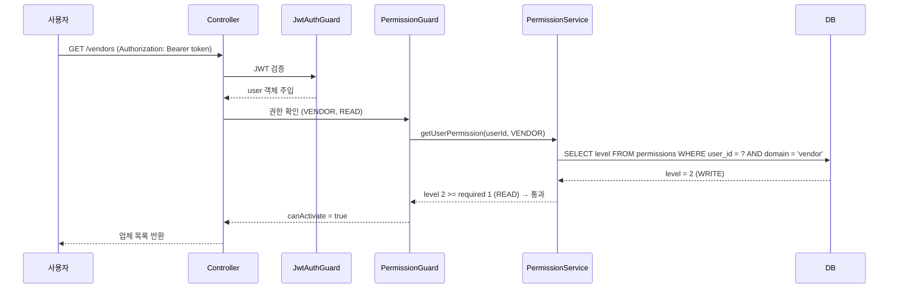

# Google Sheets에서 NestJS 어드민으로 — 팀 계층 RBAC 설계

---

처음엔 임시였다. "일단 Google Sheets로 관리하다가 나중에 시스템 만들자"는 계획이었다. 그 "나중에"가 꽤 오래 걸렸다.

업체 관리, 배송 관리, 주문 관리가 모두 스프레드시트로 돌아갔다. 담당자가 직접 셀을 수정하고, 수식으로 집계하고, 공유 링크로 협업했다. 어느 정도까지는 잘 됐다.

팀이 커지면서 문제가 생겼다. 시트 공유 권한은 "편집자"와 "뷰어" 두 가지뿐이었다. 특정 팀은 주문 데이터만 봐야 하는데 배송 데이터까지 보였다. 특정 파트는 자기 담당 업체만 수정해야 하는데 전체 업체 목록에 접근할 수 있었다. 실수로 다른 팀 데이터를 수정하는 일도 생겼다.

어드민 시스템을 만들어야 한다는 결론은 자연스럽게 나왔다. 문제는 권한 모델이었다.

---

## 권한 모델을 어떻게 설계할 것인가

RBAC(Role-Based Access Control, 역할 기반 접근 제어) 설계에서 가장 어려운 부분은 "얼마나 세분화할 것인가"였다. 너무 단순하면 실제 운영 요구를 못 따라가고, 너무 복잡하면 관리 자체가 부담이 된다.

조직 구조를 먼저 정의했다.



그리고 도메인별 4단계 권한을 정의했다.

| 레벨 | 이름 | 설명 |
|---|---|---|
| 0 | **NONE** | 해당 도메인 접근 불가 |
| 1 | **READ** | 조회만 가능 |
| 2 | **WRITE** | 조회 + 생성 + 수정 가능 |
| 3 | **MANAGE** | 조회 + 생성 + 수정 + 삭제 + 권한 위임 가능 |

"팀 관리자는 팀 내 모든 도메인을 관리할 수 있고, 파트 관리자는 파트 범위 내에서 쓰기 권한을 가진다"고 한 문장으로 설명할 수 있어야 한다고 생각했다. 그 기준으로 설계했다.

---

## 스키마

```typescript
export enum Domain {
  VENDOR = 'vendor',       // 업체 관리
  DELIVERY = 'delivery',   // 배송 관리
  ORDER = 'order',         // 주문 관리
  USER = 'user',           // 사용자 관리 (어드민 전용)
}

export enum PermissionLevel {
  NONE = 0,
  READ = 1,
  WRITE = 2,
  MANAGE = 3,
}
```

```sql
-- 조직 계층 테이블
CREATE TABLE teams (id UUID PRIMARY KEY, name VARCHAR(100), created_at TIMESTAMP);
CREATE TABLE parts (id UUID PRIMARY KEY, team_id UUID REFERENCES teams(id), name VARCHAR(100), created_at TIMESTAMP);
CREATE TABLE users (
  id UUID PRIMARY KEY,
  part_id UUID REFERENCES parts(id),
  name VARCHAR(100),
  email VARCHAR(200) UNIQUE,
  role ENUM('super_admin', 'team_admin', 'part_admin', 'member'),
  created_at TIMESTAMP
);

-- 도메인별 권한 테이블
CREATE TABLE permissions (
  id UUID PRIMARY KEY,
  user_id UUID REFERENCES users(id),
  domain ENUM('vendor', 'delivery', 'order', 'user'),
  level TINYINT,  -- 0: NONE, 1: READ, 2: WRITE, 3: MANAGE
  granted_by UUID REFERENCES users(id),
  created_at TIMESTAMP,
  UNIQUE (user_id, domain)
);
```

---

## NestJS RBAC 가드 구현

### 권한 데코레이터

```typescript
export const RequirePermission = (domain: Domain, level: PermissionLevel) =>
  SetMetadata(PERMISSION_KEY, { domain, level });
```

### 권한 가드

```typescript
@Injectable()
export class PermissionGuard implements CanActivate {
  async canActivate(context: ExecutionContext): Promise<boolean> {
    const required = this.reflector.getAllAndOverride<{
      domain: Domain;
      level: PermissionLevel;
    }>(PERMISSION_KEY, [context.getHandler(), context.getClass()]);

    if (!required) return true;

    const { user } = context.switchToHttp().getRequest();

    // super_admin은 모든 권한 통과
    if (user.role === 'super_admin') return true;

    const userPermission = await this.permissionService.getUserPermission(
      user.id,
      required.domain,
    );

    return userPermission.level >= required.level;
  }
}
```

### 컨트롤러 적용

```typescript
@Controller('vendors')
@UseGuards(JwtAuthGuard, PermissionGuard)
export class VendorController {

  @Get()
  @RequirePermission(Domain.VENDOR, PermissionLevel.READ)
  findAll() { return this.vendorService.findAll(); }

  @Post()
  @RequirePermission(Domain.VENDOR, PermissionLevel.WRITE)
  create(@Body() dto: CreateVendorDto) { return this.vendorService.create(dto); }

  @Delete(':id')
  @RequirePermission(Domain.VENDOR, PermissionLevel.MANAGE)
  remove(@Param('id') id: string) { return this.vendorService.remove(id); }
}
```

---

## 전체 권한 흐름



---

## 자신의 권한 이상은 줄 수 없다

팀 관리자나 파트 관리자가 하위 인원에게 권한을 부여할 수 있다. 단, 자신이 가진 권한 이상을 줄 수 없다.

```typescript
async grant(params: {
  granterId: string;
  targetUserId: string;
  domain: Domain;
  level: PermissionLevel;
}): Promise<Permission> {
  const granterPermission = await this.getPermission(params.granterId, params.domain);

  if (granterPermission.level < PermissionLevel.MANAGE) {
    throw new ForbiddenException('권한 부여 권한이 없습니다');
  }

  // 자신의 권한 이상을 줄 수 없음
  if (params.level > granterPermission.level) {
    throw new ForbiddenException('자신의 권한 이상을 부여할 수 없습니다');
  }

  // 같은 팀 내에서만 권한 부여 가능
  await this.validateHierarchy(params.granterId, params.targetUserId);

  return this.permissionRepo.upsert({
    userId: params.targetUserId,
    domain: params.domain,
    level: params.level,
    grantedBy: params.granterId,
  });
}
```

---

## 누가 언제 무엇을 했는지

스프레드시트에서 가장 아쉬웠던 게 변경 이력 추적이었다. 어드민에서는 모든 변경 작업을 감사 로그로 남겼다.

```typescript
@Injectable()
export class AuditLogInterceptor implements NestInterceptor {
  intercept(context: ExecutionContext, next: CallHandler): Observable<any> {
    const { method, url, user, body } = context.switchToHttp().getRequest();

    // 조회(GET)는 로그 제외
    if (method === 'GET') return next.handle();

    return next.handle().pipe(
      tap(async () => {
        await this.auditLogService.log({
          userId: user.id,
          action: method,
          resource: url,
          payload: body,
          result: 'success',
          timestamp: new Date(),
        });
      }),
    );
  }
}
```

---

## 결과

| 항목 | 이전 (Google Sheets) | 이후 (NestJS 어드민) |
|---|---|---|
| 권한 단위 | 시트 전체 (편집자/뷰어) | **도메인별 4단계 (NONE/READ/WRITE/MANAGE)** |
| 조직 계층 반영 | 불가 | **팀·파트·인원 3계층 RBAC** |
| 데이터 무결성 | 수식 실수, 형식 불일치 | **스키마 검증, DTO 유효성 검사** |
| 감사 추적 | 불가 | **모든 변경 작업 로그 기록** |
| 권한 위임 | 불가 | **MANAGE 레벨이 하위 인원에게 위임 가능** |
| 자동화 | Apps Script (임시) | **NestJS 서비스 레이어로 통합** |

---

## "누가 무엇을 할 수 있는가"를 코드로 명시하는 일

Google Sheets에서 어드민으로의 전환은 단순한 도구 교체가 아니다. 스프레드시트에서는 암묵적으로 운영되던 규칙들이 코드로 명문화된다.

"A팀은 배송 데이터를 볼 수 있다"는 규칙이 시트 공유 설정이 아니라 `permissions` 테이블과 `PermissionGuard`로 표현된다. 규칙이 코드로 들어오면 검증할 수 있고, 변경 이력을 남길 수 있고, 테스트할 수 있다.

조직의 운영 방식이 더 명확해진다.
