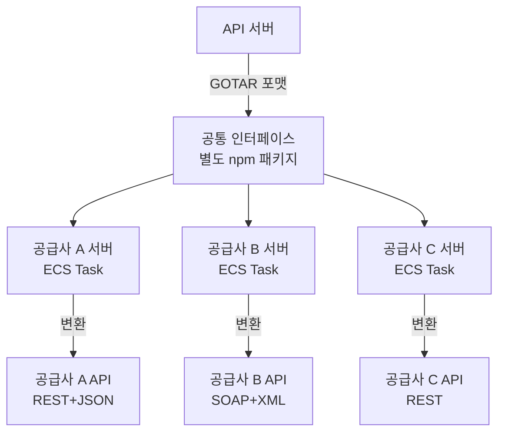
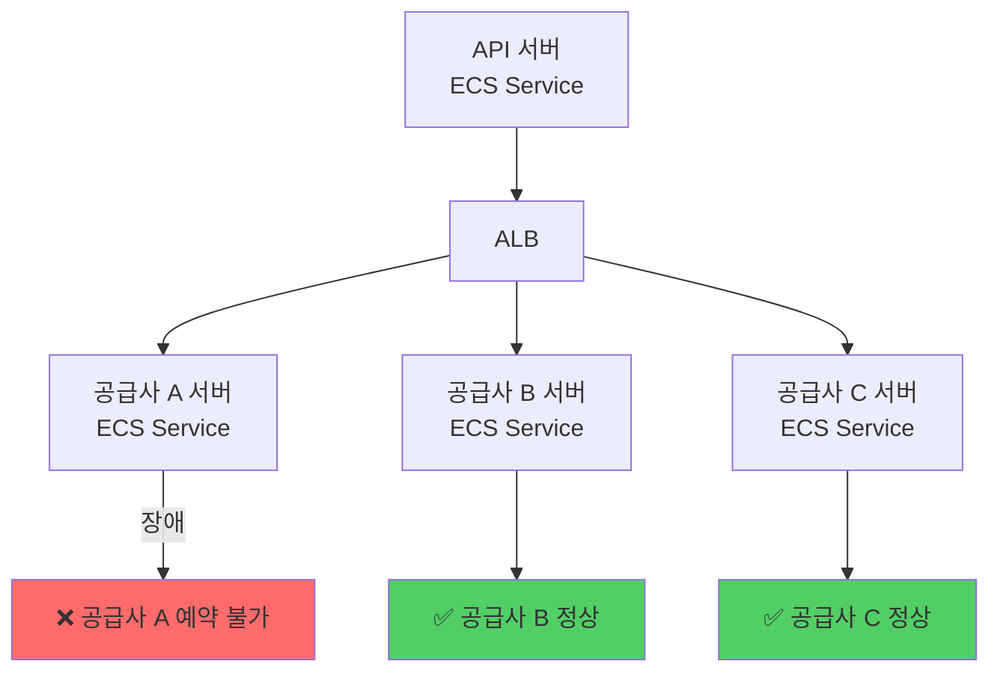
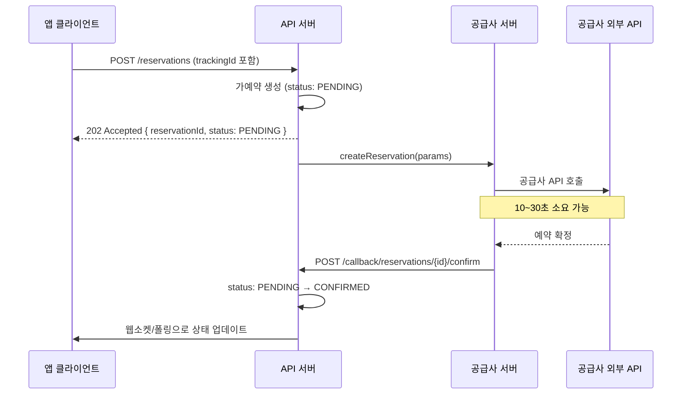

# 공급사 6곳의 API를 하나로 — 통합 어댑터 레이어 설계기

---

해외 렌터카 공급사를 새로 연동할 때마다 같은 작업을 반복했다. 공급사마다 API 스키마가 완전히 달라서, 새 공급사가 생기면 처음부터 다시 구현해야 했다.

그리고 한 공급사 서버가 느려지면 전체 예약 API가 같이 느려졌다. 공급사 A가 응답을 30초 만에 주면, 그 30초 동안 B, C를 기다리는 사용자도 영향을 받았다.

공급사 통합 어댑터 레이어는 이 두 문제를 해결하기 위해 설계했다.

---

## 공급사마다 다른 세계

공급사 A는 REST + JSON, 공급사 B는 SOAP + XML, 차종 코드도 다르고, 예약 상태 코드도 다르고, 에러 코드도 다르다.

```
[공급사별 예약 생성 API 비교]

공급사 A (REST):
  POST /reservations
  { "vehicleCode": "CCAR", "pickupDate": "2026-03-01" }

공급사 B (SOAP):
  <CreateReservation>
    <CarCategory>Compact</CarCategory>
    <PickupDateTime>20260301T000000</PickupDateTime>
  </CreateReservation>

공급사 C (REST, 다른 스키마):
  POST /bookings
  { "car_type": "compact", "start_date": "2026/03/01" }
```

공급사가 6곳이면 이 파싱 로직이 6벌 존재한다. 새 공급사가 생기면 7번째 벌이 추가된다. API 서버는 공급사 수만큼 복잡해진다.

---

## 인터페이스를 먼저 정의했다

처음에 든 생각은 "공통 포맷을 만들자"였다. 공급사가 몇 개든, 어떤 스키마든 API 서버는 하나의 포맷만 알면 된다.

인터페이스를 별도 레포로 관리해 npm 패키지로 배포했다. API 서버와 공급사별 서버가 같은 패키지를 참조한다. 인터페이스가 바뀌면 양쪽 모두 컴파일 에러가 난다.

```typescript
export interface GotarVehicle {
  vehicleId: string;
  category: VehicleCategory;   // 'ECONOMY' | 'COMPACT' | 'SUV' | ...
  transmission: 'AUTO' | 'MANUAL';
  seats: number;
  imageUrl: string;
}

export interface GotarReservation {
  reservationId: string;
  trackingId: string;          // 멱등키
  status: ReservationStatus;   // 'PENDING' | 'CONFIRMED' | 'CANCELLED'
  vehicle: GotarVehicle;
  pickupLocation: GotarLocation;
  returnLocation: GotarLocation;
  pickupAt: Date;
  returnAt: Date;
  totalAmount: Money;
  currency: string;
}

// 공급사 서버가 구현해야 하는 인터페이스
export interface IGotarSupplierAdapter {
  searchVehicles(params: SearchParams): Promise<GotarVehicle[]>;
  createReservation(params: CreateReservationParams): Promise<GotarReservation>;
  cancelReservation(reservationId: string): Promise<void>;
  getReservation(reservationId: string): Promise<GotarReservation>;
}
```

---

## 공급사별 서버를 분리했다

인터페이스를 정의하고 나서 다음 질문은 "변환 로직을 어디에 둘 것인가"였다.

API 서버 안에 두면 공급사가 늘어날수록 API 서버가 커진다. 공급사 A 코드를 수정할 때 B, C 코드가 영향을 받을 수 있다. 공급사 A 서버가 느려지면 API 서버 전체가 느려진다.

공급사별 독립 서버로 분리했다. 각 서버는 공통 포맷 → 공급사 API 포맷 변환만 담당한다.



각 공급사 서버는 독립 ECS Service로 배포된다. 공급사 A 코드를 수정해도 B, C 서버는 재배포되지 않는다.

```yaml
# .github/workflows/deploy-supplier-a.yml
on:
  push:
    paths:
      - 'apps/supplier-a/**'  # 공급사 A 코드 변경 시만 트리거
    branches: [main]
```

공급사 A 서버가 다운되면 공급사 B, C 예약에 영향이 없다.



---

## 예약 확정이 30초 걸리는 공급사

공급사 API 응답이 느린 경우가 있었다. 어떤 공급사는 예약 확정까지 10~30초가 걸렸다. 동기 방식으로 처리하면 클라이언트가 30초를 기다려야 한다.

비동기 3단계 흐름으로 처리했다.



클라이언트는 즉시 `202 Accepted`를 받고, 예약 확정은 콜백으로 처리된다. 30초 타임아웃이 없다.

---

## 네트워크 오류로 같은 요청이 두 번 오면

네트워크 오류로 클라이언트가 같은 요청을 두 번 보내는 경우가 있다. 멱등키(Idempotency Key) 없이는 예약이 두 번 생성된다.

`trackingId`는 클라이언트가 생성해서 보낸다. 같은 예약 시도에는 같은 `trackingId`를 쓴다. 서버는 `trackingId`가 이미 있으면 새로 만들지 않고 기존 것을 반환한다.

```typescript
async createReservation(
  params: CreateReservationParams,
  trackingId: string,
): Promise<GotarReservation> {
  const existing = await this.reservationRepo.findOne({
    where: { trackingId },
    lock: { mode: 'pessimistic_read' },
  });

  if (existing) {
    this.logger.log(`중복 요청 감지: trackingId=${trackingId}, 기존 예약 반환`);
    return existing;
  }

  const reservation = await this.reservationRepo.save({
    trackingId,
    status: ReservationStatus.PENDING,
    ...params,
  });

  await this.supplierClient.createReservation(reservation);
  return reservation;
}
```

---

## 공급사 API 문서와 실제 동작이 다를 때

공급사 API 문서와 실제 동작이 다른 경우가 많았다. 문서에는 `string`이라고 돼 있는데 실제로는 `null`이 오거나, 문서에 없는 에러 코드가 오는 경우다.

Zod로 응답 구조를 검증하고, 파싱 실패 시 Slack 알림을 보낸다. 원본 응답은 DocumentDB에 전수 저장한다.

```typescript
export class SupplierResponseValidator {
  validate(response: unknown, schema: ZodSchema): ValidationResult {
    const result = schema.safeParse(response);

    if (!result.success) {
      this.logger.error('공급사 응답 스키마 불일치', {
        expected: schema.description,
        received: response,
        errors: result.error.errors,
      });

      this.slackNotifier.alert({
        title: '공급사 응답 스키마 불일치',
        severity: 'warning',
      });

      return { valid: false, partial: this.extractPartial(response) };
    }

    return { valid: true, data: result.data };
  }
}
```

파싱이 실패해도 부분 데이터라도 추출해서 처리를 이어간다. 완전히 막히는 것보다 부분 성공이 낫다.

---

## 정산 불일치를 정산 시점 전에 잡기

공급사 측 금액과 DB의 금액이 다른 경우가 있었다. 공급사가 환율 변동이나 프로모션 적용으로 금액을 변경하는 경우다. 정산 시점에 발견하면 이미 늦다.

6시간마다 최근 확정 예약을 공급사 API와 대조한다.

```typescript
@Cron('0 */6 * * *') // 6시간마다
async validateReservationAmounts(): Promise<void> {
  const reservations = await this.reservationRepo.findRecentConfirmed();

  for (const reservation of reservations) {
    const supplierData = await this.supplierClient.getReservation(
      reservation.supplierReservationId,
    );

    if (supplierData.totalAmount !== reservation.totalAmount) {
      await this.slackNotifier.alert({
        title: '정산 금액 불일치 감지',
        message: `예약 ${reservation.id}: DB ${reservation.totalAmount} ≠ 공급사 ${supplierData.totalAmount}`,
        severity: 'warning',
        metadata: {
          reservationId: reservation.id,
          supplierId: reservation.supplierId,
          diff: supplierData.totalAmount - reservation.totalAmount,
        },
      });
    }
  }
}
```

---

## 결과

| 항목 | 이전 | 이후 |
|---|---|---|
| 인벤토리 | 7개국 / 2천 대 | **71개국 / 400만 대** |
| 공급사 추가 비용 | 전체 재구현 | **Adapter 1개 구현** |
| 공급사 장애 영향 | 전체 서비스 영향 | **해당 공급사만 영향** |
| 중복 예약 | 발생 가능 | **trackingId 멱등키로 차단** |
| 정산 불일치 | 정산 시점 발견 | **6시간 주기 사전 탐지** |

---

## 추상화는 최소한으로

설계하면서 가장 많이 고민한 건 "어디까지 추상화할 것인가"였다.

공급사마다 지원하는 기능이 다르다. 어떤 공급사는 실시간 가격 조회를 지원하고, 어떤 공급사는 하루 단위 캐시만 제공한다. 이 차이를 공통 인터페이스로 완전히 숨기면 — 기능이 없는 공급사에서 "지원하지 않는 기능"을 어떻게 처리할지가 문제가 된다.

결국 택한 방법은 "공통 인터페이스는 최소한으로, 공급사별 확장은 허용"이었다. 모든 공급사가 반드시 구현해야 하는 핵심 인터페이스를 정의하고, 공급사별 특화 기능은 선택적 인터페이스로 분리했다.
