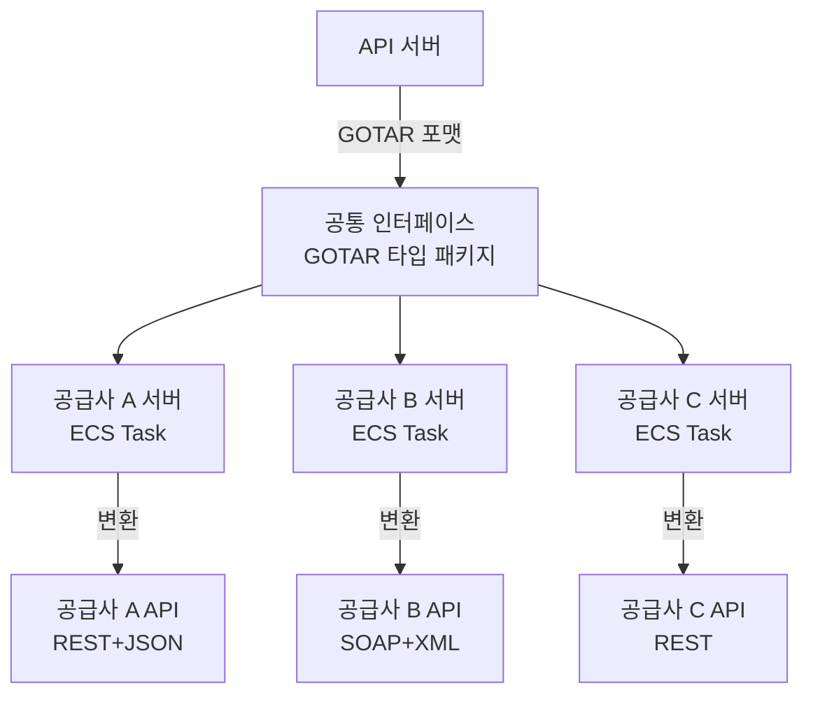
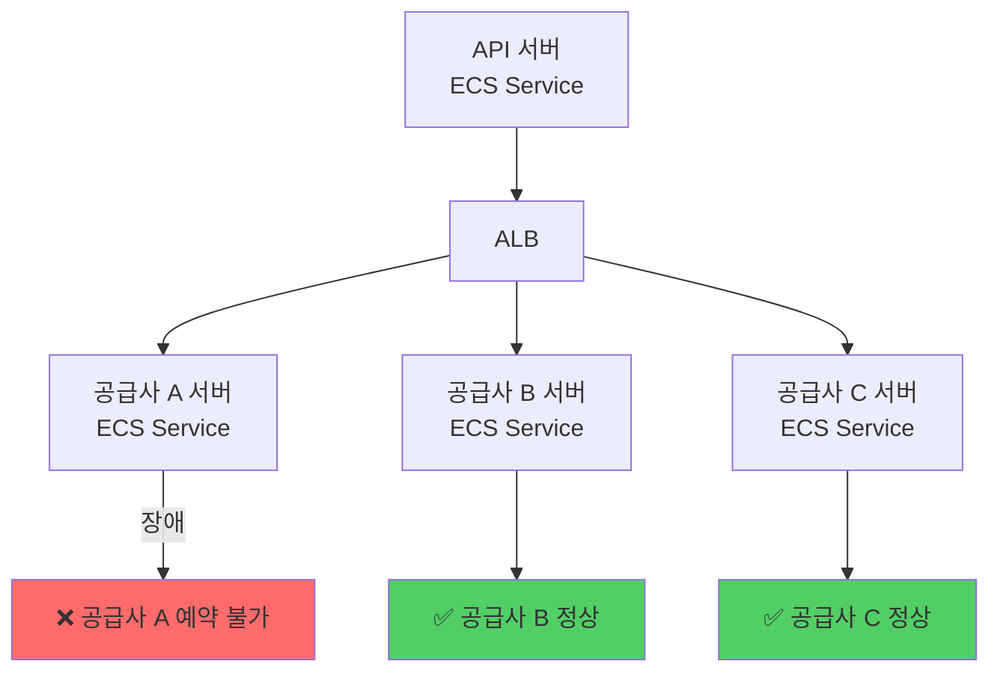
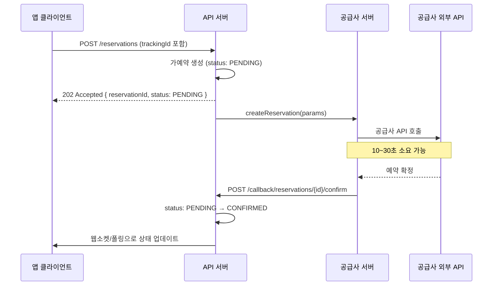

# 공급사 6곳의 API를 하나로 — 통합 어댑터 레이어 설계기

해외 렌터카 공급사 API를 여러 개 연동해본 적 있으신가요? 공급사마다 스키마가 완전히 달라서, 새 공급사가 생길 때마다 처음부터 다시 구현해야 하는 상황 말이에요.

저희 팀이 정확히 그 상황이었습니다. 공급사 6곳을 연동하면서 파싱 로직이 6벌 존재했고, 한 공급사 서버가 느려지면 전체 예약 API가 같이 느려졌습니다. 이 두 문제를 해결하기 위해 통합 어댑터 레이어를 설계했고, 결과적으로 인벤토리가 **2천 대에서 400만 대**로 늘었습니다. 공급사 추가 비용은 전체 재구현에서 어댑터 1개 구현으로 줄었고요.

어떻게 여기까지 왔는지 풀어보겠습니다.

## 공급사마다 다른 세계

공급사 A는 REST + JSON, 공급사 B는 SOAP + XML입니다. 차종 코드도 다르고, 예약 상태 코드도 다르고, 에러 코드도 다릅니다.

```
[공급사별 예약 생성 API 비교]

공급사 A (REST):
  POST /reservations
  { "vehicleCode": "CCAR", "pickupDate": "2026-03-01" }

공급사 B (SOAP):
  <CreateReservation>
    <CarCategory>Compact</CarCategory>
    <PickupDateTime>20260301T000000</PickupDateTime>
  </CreateReservation>

공급사 C (REST, 다른 스키마):
  POST /bookings
  { "car_type": "compact", "start_date": "2026/03/01" }
```

공급사가 6곳이면 이 파싱 로직이 6벌 존재합니다. 새 공급사가 생기면 7번째 벌이 추가됩니다. API 서버는 공급사 수만큼 복잡해지고, 공급사 A 코드를 수정할 때 B, C 코드가 영향을 받을 수 있습니다.

## 인터페이스를 먼저 정의했다

처음에 든 생각은 "공통 포맷을 만들자"였습니다. 공급사가 몇 개든, 어떤 스키마든 API 서버는 하나의 포맷만 알면 됩니다.

인터페이스를 별도 타입 패키지로 분리했습니다. 래핑 서버와 코어 서버가 동일한 타입을 참조합니다. 인터페이스가 바뀌면 양쪽 모두 컴파일 에러가 납니다.

```typescript
export interface GotarVehicle {
  vehicleId: string;
  category: VehicleCategory;   // 'ECONOMY' | 'COMPACT' | 'SUV' | ...
  transmission: 'AUTO' | 'MANUAL';
  seats: number;
  imageUrl: string;
}

export interface GotarReservation {
  reservationId: string;
  trackingId: string;          // 멱등키
  status: ReservationStatus;   // 'PENDING' | 'CONFIRMED' | 'CANCELLED'
  vehicle: GotarVehicle;
  pickupLocation: GotarLocation;
  returnLocation: GotarLocation;
  pickupAt: Date;
  returnAt: Date;
  totalAmount: Money;
  currency: string;
}

// 공급사 서버가 구현해야 하는 인터페이스
export interface IGotarSupplierAdapter {
  searchVehicles(params: SearchParams): Promise<GotarVehicle[]>;
  createReservation(params: CreateReservationParams): Promise<GotarReservation>;
  cancelReservation(reservationId: string): Promise<void>;
  getReservation(reservationId: string): Promise<GotarReservation>;
}
```

## 공급사별 서버를 분리했다

인터페이스를 정의하고 나서 다음 질문은 "변환 로직을 어디에 둘 것인가"였습니다.

API 서버 안에 두면 공급사가 늘어날수록 API 서버가 커집니다. 공급사 A 서버가 느려지면 API 서버 전체가 느려지고요. 저희 팀은 공급사별 독립 서버로 분리하는 방향을 택했습니다. 각 서버는 공통 포맷에서 공급사 API 포맷으로의 변환만 담당합니다.



각 공급사 서버는 독립 ECS Service로 배포됩니다. 공급사 A 코드를 수정해도 B, C 서버는 재배포되지 않습니다.

```yaml
# .github/workflows/deploy-supplier-a.yml
on:
  push:
    paths:
      - 'apps/supplier-a/**'  # 공급사 A 코드 변경 시만 트리거
    branches: [main]
```

장애 격리 효과도 명확합니다. 공급사 A 서버가 다운되면 공급사 B, C 예약에는 영향이 없습니다.



---

## 예약 확정이 30초 걸리는 공급사

공급사 API 응답이 느린 경우가 있었습니다. 어떤 공급사는 예약 확정까지 10~30초가 걸렸는데, 동기 방식으로 처리하면 클라이언트가 30초를 기다려야 합니다.

저희 팀은 비동기 3단계 흐름으로 처리했습니다.



클라이언트는 즉시 `202 Accepted`를 받고, 예약 확정은 콜백으로 처리됩니다. 30초 타임아웃이 없습니다.

## 네트워크 오류로 같은 요청이 두 번 오면

네트워크 오류로 클라이언트가 같은 요청을 두 번 보내는 경우가 있습니다. 멱등키 없이는 예약이 두 번 생성됩니다.

`trackingId`는 클라이언트가 생성해서 보냅니다. 같은 예약 시도에는 같은 `trackingId`를 씁니다. 서버는 `trackingId`가 이미 있으면 새로 만들지 않고 기존 것을 반환합니다.

```typescript
async createReservation(
  params: CreateReservationParams,
  trackingId: string,
): Promise<GotarReservation> {
  const existing = await this.reservationRepo.findOne({
    where: { trackingId },
    lock: { mode: 'pessimistic_read' },
  });

  if (existing) {
    this.logger.log(`중복 요청 감지: trackingId=${trackingId}, 기존 예약 반환`);
    return existing;
  }

  const reservation = await this.reservationRepo.save({
    trackingId,
    status: ReservationStatus.PENDING,
    ...params,
  });

  await this.supplierClient.createReservation(reservation);
  return reservation;
}
```

## 공급사 API 문서와 실제 동작이 다를 때

공급사 API 문서와 실제 동작이 다른 경우가 많았습니다. 문서에는 `string`이라고 돼 있는데 실제로는 `null`이 오거나, 문서에 없는 에러 코드가 오는 경우입니다.

Zod로 응답 구조를 검증하고, 파싱 실패 시 Slack 알림을 보냅니다. 원본 응답은 DocumentDB에 전수 저장합니다.

```typescript
export class SupplierResponseValidator {
  validate(response: unknown, schema: ZodSchema): ValidationResult {
    const result = schema.safeParse(response);

    if (!result.success) {
      this.logger.error('공급사 응답 스키마 불일치', {
        expected: schema.description,
        received: response,
        errors: result.error.errors,
      });

      this.slackNotifier.alert({
        title: '공급사 응답 스키마 불일치',
        severity: 'warning',
      });

      return { valid: false, partial: this.extractPartial(response) };
    }

    return { valid: true, data: result.data };
  }
}
```

파싱이 실패해도 부분 데이터라도 추출해서 처리를 이어갑니다. 완전히 막히는 것보다 부분 성공이 낫습니다.

## 정산 불일치를 정산 시점 전에 잡기

공급사 측 금액과 DB의 금액이 다른 경우가 있었습니다. 공급사가 환율 변동이나 프로모션 적용으로 금액을 변경하는 경우인데, 정산 시점에 발견하면 이미 늦습니다.

저희 팀은 D+1 확정 예약을 6시간 주기로 공급사 API와 대조합니다.

```typescript
@Cron('0 */6 * * *') // 6시간마다
async validateReservationAmounts(): Promise<void> {
  const reservations = await this.reservationRepo.findRecentConfirmed();

  for (const reservation of reservations) {
    const supplierData = await this.supplierClient.getReservation(
      reservation.supplierReservationId,
    );

    if (supplierData.totalAmount !== reservation.totalAmount) {
      await this.slackNotifier.alert({
        title: '정산 금액 불일치 감지',
        message: `예약 ${reservation.id}: DB ${reservation.totalAmount} ≠ 공급사 ${supplierData.totalAmount}`,
        severity: 'warning',
        metadata: {
          reservationId: reservation.id,
          supplierId: reservation.supplierId,
          diff: supplierData.totalAmount - reservation.totalAmount,
        },
      });
    }
  }
}
```

---

## 지금 어디까지 왔고, 무엇이 남았나

이 설계로 인벤토리는 7개국 2천 대에서 71개국 400만 대로 늘었습니다. 공급사 추가 비용은 전체 재구현에서 어댑터 1개 구현으로 줄었고, 공급사 장애가 해당 공급사 예약에만 영향을 미치게 됐습니다. 중복 예약은 `trackingId` 멱등키로 차단하고, 정산 불일치는 D+1 사전 탐지로 잡습니다.

한계도 있습니다. 공급사마다 지원하는 기능이 다릅니다. 어떤 공급사는 실시간 가격 조회를 지원하고, 어떤 공급사는 하루 단위 캐시만 제공합니다. 이 차이를 공통 인터페이스로 완전히 숨기면 기능이 없는 공급사에서 "지원하지 않는 기능"을 어떻게 처리할지가 문제가 됩니다.

현재는 공통 인터페이스를 최소한으로 유지하고, 공급사별 특화 기능은 선택적 인터페이스로 분리하는 방식을 쓰고 있습니다. 공급사가 더 늘어나면 이 선택적 인터페이스 관리가 복잡해질 수 있어서, 기능 플래그 기반의 capability 선언 방식으로 전환하는 것을 검토 중입니다.
