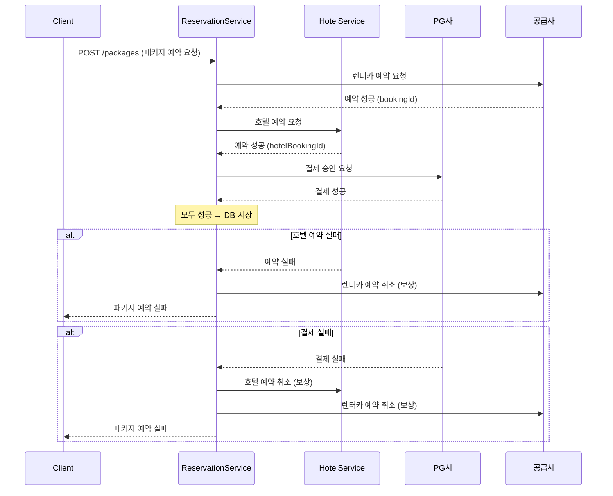
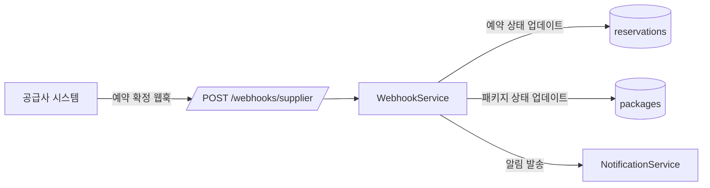

# 예약 성공, 결제 실패 — 분산 트랜잭션 없이 일관성 확보하기

패키지 상품 기획이 확정됐을 때, 가장 먼저 든 생각은 그거였다.

"렌터카 예약은 성공했는데 호텔 예약이 실패하면?"

솔직히 처음엔 좀 막막했다. 기존 렌터카 예약 흐름은 별 게 없었다. 공급사 API를 호출해 예약을 잡고, 성공하면 PG사 결제를 진행하고, 결제가 완료되면 DB에 기록한다. 모두 같은 서비스 안에서 순차적으로 처리됐다. 문제가 생기면 어디서 터진 건지 로그를 뒤져야 알 수 있었지만, 그래도 단일 도메인이라 어떻게든 수습이 됐다.

호텔을 끼워 넣는 순간 상황이 달라졌다. 두 도메인이 서로 다른 외부 시스템과 통신하는 상황에서 "전부 성공하거나 전부 실패하거나"를 보장하는 건 생각보다 훨씬 복잡한 문제였다.

## 예약과 결제가 한 덩어리였다

기존 코드를 보면 이런 식이었다:

```typescript
// 기존: 예약과 결제가 하나의 서비스 메서드에 묶임
async createReservation(dto: CreateReservationDto) {
  // 1. 공급사 예약
  const supplierRes = await this.supplierClient.book(dto);

  // 2. PG 결제 (예약 성공 후 바로 결제)
  const payment = await this.pgClient.charge({
    amount: dto.amount,
    orderId: supplierRes.bookingId,
  });

  // 3. DB 저장 — 예약과 결제를 같은 트랜잭션으로
  return this.db.transaction(async (trx) => {
    await trx.insert('reservations', { ...supplierRes });
    await trx.insert('payments', { ...payment });
  });
}
```

이 구조의 문제는 세 가지였다.

첫째, 장애 원인을 분리할 수 없었다. 결제 실패인지 공급사 예약 실패인지 로그를 뒤져야 알 수 있었다. 둘째, 호텔 도메인을 삽입할 자리가 없었다. 렌터카 예약 성공 → 호텔 예약 → 결제 순서로 가려면 중간에 끼워 넣을 구조가 아니었다. 셋째, 부분 실패 처리가 없었다. 공급사 예약은 됐는데 PG 결제가 실패하면 공급사 예약을 취소하는 로직이 없었다.

## 2PC는 처음부터 불가능했다

세 가지 방법을 검토했다.

**2PC(2단계 커밋)**는 모든 참여자가 준비 완료 신호를 보낸 뒤 일괄 커밋하는 방식이다. 이론적으로는 가장 강력한 일관성을 보장한다. 그런데 PG사와 해외 공급사가 XA 트랜잭션을 지원하지 않았다. 처음부터 불가능한 선택지였다.

**사가 오케스트레이터**는 중앙 오케스트레이터가 각 서비스 호출을 조율하는 방식이다. 단계가 많아질수록 강력하지만, 지금 흐름은 "예약 → 결제" 2단계가 전부였다. 오케스트레이터를 위한 별도 서비스를 띄우고 상태를 관리하는 비용이 이득보다 크다고 판단했다.

**보상 트랜잭션**은 말 그대로다. 각 단계가 성공하면 다음 단계로 진행하고, 실패하면 이미 성공한 단계를 역순으로 취소한다. 외부 시스템이 "취소 API"를 제공하기만 하면 된다. 렌터카 공급사와 PG사 모두 취소 API가 있었다. 기존 인프라 위에 REST 웹훅으로 구현할 수 있다는 점도 결정적이었다.



## 예약·결제 테이블을 분리했다

기존에는 `reservations` 테이블에 결제 정보가 섞여 있었다. 분리했다:

```sql
-- 예약 테이블 (공급사 예약 정보만)
CREATE TABLE reservations (
  id          UUID PRIMARY KEY,
  package_id  UUID,
  type        ENUM('car', 'hotel'),
  supplier_id VARCHAR(50),
  booking_ref VARCHAR(100),   -- 공급사 예약 번호
  status      ENUM('pending', 'confirmed', 'cancelled'),
  created_at  TIMESTAMP
);

-- 결제 테이블 (PG 결제 정보만)
CREATE TABLE payments (
  id             UUID PRIMARY KEY,
  package_id     UUID,
  pg_transaction VARCHAR(100),  -- PG사 거래 번호
  amount         DECIMAL(10,2),
  status         ENUM('pending', 'paid', 'refunded', 'failed'),
  created_at     TIMESTAMP
);
```

이렇게 분리하면 "예약은 됐는데 결제가 안 됐다"는 상황을 DB 쿼리 하나로 파악할 수 있다. CS 문의가 들어왔을 때 로그를 뒤지는 대신 테이블 두 개를 조인하면 됐다. 작은 변화처럼 보이지만 실제로 장애 대응 속도가 달라졌다.

## 보상 트랜잭션 구현

핵심은 `compensations` 배열이다. 각 단계가 성공할 때마다 취소 함수를 배열에 쌓아두고, 실패하면 역순으로 실행한다.

```typescript
@Injectable()
export class PackageReservationService {
  async createPackage(dto: CreatePackageDto): Promise<Package> {
    const compensations: Array<() => Promise<void>> = [];

    try {
      // Step 1: 렌터카 예약
      const carBooking = await this.carSupplierClient.book({
        pickupLocation: dto.pickupLocation,
        dropoffLocation: dto.dropoffLocation,
        vehicleId: dto.vehicleId,
      });
      compensations.push(() =>
        this.carSupplierClient.cancel(carBooking.bookingRef)
      );

      // Step 2: 호텔 예약
      const hotelBooking = await this.hotelService.book({
        hotelId: dto.hotelId,
        checkIn: dto.checkIn,
        checkOut: dto.checkOut,
      });
      compensations.push(() =>
        this.hotelService.cancel(hotelBooking.bookingRef)
      );

      // Step 3: 결제
      const payment = await this.pgClient.charge({
        amount: dto.totalAmount,
        orderId: `PKG-${dto.packageId}`,
      });
      compensations.push(() =>
        this.pgClient.refund(payment.transactionId)
      );

      // 모두 성공 → DB 저장
      return await this.db.transaction(async (trx) => {
        await trx.insert('reservations', [
          { packageId: dto.packageId, type: 'car', bookingRef: carBooking.bookingRef, status: 'confirmed' },
          { packageId: dto.packageId, type: 'hotel', bookingRef: hotelBooking.bookingRef, status: 'confirmed' },
        ]);
        await trx.insert('payments', {
          packageId: dto.packageId,
          pgTransaction: payment.transactionId,
          amount: dto.totalAmount,
          status: 'paid',
        });
        return { packageId: dto.packageId, status: 'confirmed' };
      });

    } catch (error) {
      this.logger.error('Package reservation failed, running compensations', error);
      await this.runCompensations(compensations);
      throw new PackageReservationFailedException(error.message);
    }
  }

  private async runCompensations(
    compensations: Array<() => Promise<void>>
  ): Promise<void> {
    for (const compensate of compensations.reverse()) {
      try {
        await compensate();
      } catch (err) {
        // 보상 실패는 로그만 남기고 계속 진행 (수동 처리 대상)
        this.logger.error('Compensation failed — manual intervention required', err);
      }
    }
  }
}
```

여기서 한 가지 솔직하게 말하면, 보상 트랜잭션이 완벽하지 않다는 건 처음부터 알고 있었다. 보상 자체가 실패하면? 공급사 API가 다운됐거나 PG사 환불 API가 타임아웃 나면? 그 경우는 로그를 남기고 수동 처리 대상으로 분류했다. 완전 자동화보다 "실패를 명시적으로 드러내는 것"이 더 중요하다고 판단했다. `Compensation failed — manual intervention required`가 로그에 찍히는 게 조용히 데이터가 불일치 상태로 남는 것보다 훨씬 다루기 쉽다.

## 공급사 예약 확정은 실시간이 아니었다

구현하다 보니 예상 못 한 문제가 하나 더 있었다. 공급사 예약 확정이 실시간으로 오지 않는 경우가 있었다. 예약 요청 후 수 분 내에 확정 웹훅이 오는 구조였다.



```typescript
@Post('/webhooks/supplier/:supplierId')
async handleSupplierWebhook(
  @Param('supplierId') supplierId: string,
  @Body() payload: SupplierWebhookPayload,
  @Headers('x-supplier-signature') signature: string,
) {
  this.webhookService.verifySignature(supplierId, payload, signature);

  await this.reservationService.updateByBookingRef({
    supplierId,
    bookingRef: payload.bookingRef,
    status: this.mapSupplierStatus(payload.status),
  });
}
```

예약 테이블에 `pending` 상태를 두고, 웹훅이 오면 `confirmed`로 바꾸는 방식으로 처리했다. 테이블을 분리해 둔 덕분에 예약 상태와 결제 상태를 독립적으로 추적할 수 있었다. 만약 기존처럼 한 테이블에 섞여 있었다면 웹훅 처리 로직이 훨씬 복잡해졌을 것이다.

---

## 출시하고 나서

패키지 상품은 출시됐고, 호텔 매출 비중이 전체의 60%까지 올라갔다. 장애 원인 분리는 예약/결제 테이블 분리로 즉시 파악 가능해졌고, CS 대응 속도도 눈에 띄게 개선됐다. 보상 트랜잭션 커버리지는 렌터카 예약 → 호텔 예약 → 결제 3단계 전체를 커버한다.

지금 돌아보면 아쉬운 점이 있다. 보상 실패 케이스를 수동 처리로 남겨둔 건 현실적인 선택이었지만, 보상 실패 이벤트를 별도 큐에 쌓아서 재시도 로직을 붙였으면 더 좋았을 것 같다. 당시엔 "일단 로그 남기고 수동으로"가 빠른 출시를 위한 합리적인 트레이드오프였지만, 트래픽이 늘어나면 수동 처리 건수도 같이 늘어난다.

사가 오케스트레이터를 너무 일찍 포기한 것도 다시 생각해볼 여지가 있다. 지금은 2단계지만 나중에 여행자 보험이나 공항 픽업 같은 상품이 추가되면 단계가 늘어난다. 그때 가서 오케스트레이터로 전환하는 게 지금 당장 도입하는 것보다 더 비쌀 수 있다.

2PC를 쓸 수 없다는 현실을 인정한 게 시작점이었다. 실패를 빠르게 감지하고, 복구 경로를 명확히 만들고, 실패가 났을 때 어디서 났는지 즉시 알 수 있게 하는 것. 그 정도가 우리가 할 수 있는 범위였다.
