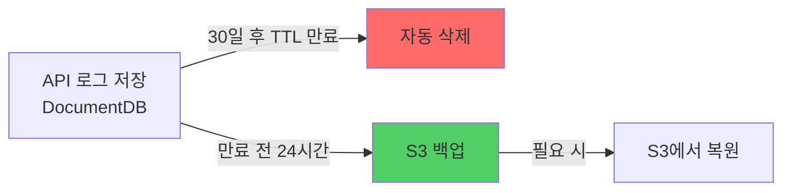

# DocumentDB 스토리지 비용 91% 절감 — TTL 인덱스와 S3 백업

AWS 청구서를 항목별로 뜯어보다가 DocumentDB 스토리지 비용이 눈에 걸렸다. 서비스가 성장하면 비용이 느는 건 당연한데, 이건 성장과 무관하게 그냥 쌓이고 있었다. 조회는 최근 1개월치만 하는데, 데이터는 서비스 시작부터 전부 남아 있었다.

결론부터 말하면, 월 140만 원이던 DocumentDB 스토리지 비용이 12만 원으로 줄었다. 91% 절감. 기술적으로는 TTL 인덱스 하나와 아카이빙 스케줄러가 전부였다. 오래 걸린 건 코드가 아니라 사업부 합의였다.

## 왜 이렇게 커졌나

공급사 API 요청/응답 로그를 전수 저장하고 있었다. 예약 조회, 차량 검색, 가격 조회 — 외부 API 호출마다 원본 요청과 응답이 그대로 쌓였다. 응답 하나가 수백 KB인 경우도 있었다.

```
{
  supplierId: "supplier-a",
  endpoint: "/vehicles/search",
  requestBody: { ... },
  responseBody: { ... },  // 수백 KB
  createdAt: "2024-01-15T09:00:00Z"
}
```

디버깅이나 정산 검증에 필요한 데이터였다. 근데 실제로 1년 전 로그를 꺼내 본 적이 한 번도 없었다. 최근 1개월치만 쓰고 있었다. 나머지는 그냥 돈 내면서 보관하고 있던 셈이다.

## 합의가 먼저였다

해결책은 누구나 생각할 수 있는 거였다. 30일 지난 건 지우되, 지우기 전에 S3에 옮겨두면 된다. 근데 바로 실행하지 않았다.

과거 데이터를 지우는 건 사업부 확인이 필요했다. "최근 1개월 데이터만 있으면 되는 거 맞죠?" — 이걸 먼저 물어봤다. 사업부에서 예전 데이터를 찾는 경우가 있을 수 있으니까. 확인받고, 과거 데이터는 S3에 백업해서 필요하면 꺼낼 수 있는 구조로 가기로 했다.

이 과정이 생각보다 길었다. 어떤 케이스에서 오래된 로그가 필요한지, 정산 분쟁이 생기면 몇 년치까지 봐야 하는지, 법적 보관 의무는 없는지. 기술팀 혼자 판단할 수 없는 질문들이었다. 합의가 끝나고 나서야 코드를 짰다.

## 구조



TTL 인덱스를 걸면 MongoDB/DocumentDB가 알아서 만료된 도큐먼트를 삭제한다. 별도 배치 작업이 필요 없다.

```javascript
// DocumentDB TTL 인덱스 생성
db.api_logs.createIndex(
  { createdAt: 1 },
  { expireAfterSeconds: 30 * 24 * 60 * 60 }  // 30일
);
```

아카이빙은 매일 새벽 2시에 돌리는 스케줄러가 처리한다. TTL 만료 하루 전인 29일치 로그를 S3에 올린다.

```typescript
@Cron('0 2 * * *') // 매일 새벽 2시
async archiveLogs(): Promise<void> {
  const cutoffDate = subDays(new Date(), 29); // TTL 만료 하루 전

  const oldLogs = await this.logRepo.find({
    createdAt: { $lt: cutoffDate },
  });

  if (oldLogs.length === 0) return;

  const grouped = groupBy(oldLogs, (log) =>
    format(log.createdAt, 'yyyy/MM/dd'),
  );

  for (const [date, logs] of Object.entries(grouped)) {
    const key = `api-logs/${date}/logs-${Date.now()}.json.gz`;
    const compressed = await gzip(JSON.stringify(logs));

    await this.s3Client.send(
      new PutObjectCommand({
        Bucket: 'camoa-log-archive',
        Key: key,
        Body: compressed,
        ContentEncoding: 'gzip',
      }),
    );
  }
}
```

S3 Standard에 올린다. 접근 빈도가 낮으니 S3 수명 주기 정책으로 비용을 더 줄일 수 있지만, 지금은 그 단계까지 갈 필요가 없었다.

---

DocumentDB 스토리지는 30일치만 유지되고, 나머지는 S3에 압축 보관된다. 월 비용은 140만 원에서 12만 원으로 줄었다. 데이터 유실 없이.

돌이켜보면 이 작업에서 제일 오래 걸린 건 코드가 아니라 합의였다. TTL 인덱스 설정하고 아카이빙 스크립트 만드는 건 하루면 됐는데, "정말 지워도 되느냐"를 확인하는 데 더 오래 걸렸다. 데이터를 지우는 결정은 기술적 판단만으로 할 수 있는 게 아니니까. 그 과정이 맞다고 생각한다.
