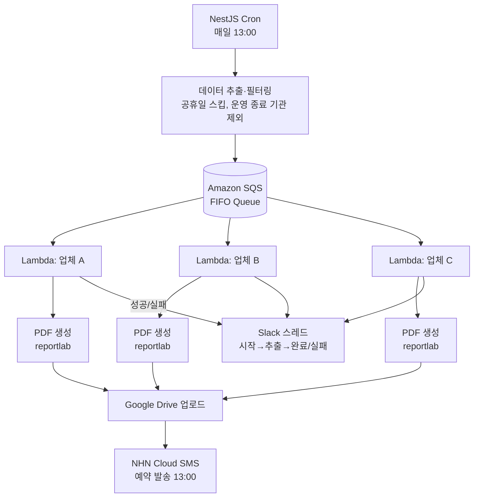
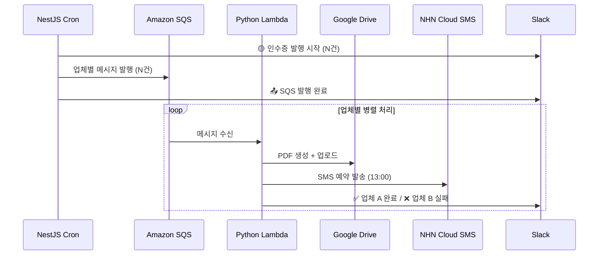

# 인수증 발송 파이프라인 재설계 — GAS에서 NestJS + SQS + Lambda로

---

어느 날 출근했더니 운영팀에서 연락이 왔다. "오늘 인수증 안 온 업체들 있어요." 확인해보니 절반 정도가 발송이 안 됐다. Google Apps Script 로그를 뒤졌는데 에러 메시지 하나 없이 그냥 멈춰 있었다. 어디서 멈췄는지, 왜 멈췄는지 알 방법이 없었다.

그날 오전 내내 수기로 재발송했다. 업체마다 PDF 뽑고, 문자 보내고. 두 시간쯤 걸렸다.

그게 처음이 아니었다. 크고 작게 합쳐 한 달에 열 번은 발송 실패가 생겼다.

---

## 기존 구조가 왜 문제였나

GAS 파이프라인은 이렇게 생겼었다.

```
GAS Trigger (매일 09:00)
  → 1. DB에서 업체 목록 조회
  → 2. 업체별 PDF 생성 (순차)
  → 3. 업체별 SMS 발송 (순차)
  → 완료 (또는 조용히 실패)
```

순차 실행이라는 게 핵심 문제였다. 업체 A의 PDF 생성이 실패하면 B, C, D 전부 멈춘다. 앞에서 막히면 뒤가 없다.

그리고 GAS는 실패해도 알림을 주지 않는다. 운영팀이 "오늘 인수증 안 왔어요"라고 연락이 와야 알았다. 실패가 조용했다.

업체 수가 늘어날수록 GAS 6분 실행 제한도 문제가 됐다. 당시 수십 곳이었는데 앞으로 더 늘어날 예정이었다.

재처리도 없었다. 실패한 업체만 다시 돌리는 방법이 없어서, 전체를 다시 실행하거나 수기로 한 건씩 처리해야 했다.

---

## 업체별로 독립시키기

핵심 아이디어는 단순했다. 업체 A가 실패해도 B, C는 정상 발송돼야 한다. 그러려면 각 업체 처리가 완전히 독립적이어야 한다.



역할 분리는 이렇게 됐다.

| 컴포넌트 | 역할 |
|---|---|
| NestJS Cron | 데이터 추출, 필터링, SQS 메시지 발행 |
| Amazon SQS | 업체별 작업 큐잉, 재시도 정책 |
| Python Lambda | PDF 생성, Drive 업로드, SMS 발송 |
| NHN Cloud SMS | SMS 예약 발송 |
| Slack | 전 과정 추적 (시작→추출→완료/실패) |

PDF 생성을 Python Lambda로 분리한 건 `reportlab` 때문이었다. Node.js 생태계 PDF 라이브러리들을 써봤는데 한글 폰트 처리가 불안정했다. Python `reportlab`이 훨씬 안정적이었고, Lambda로 분리하면 독립 배포·스케일링도 가능했다.

---

## NestJS Cron — 추출과 발행

```typescript
@Injectable()
export class InvoiceScheduler {
  @Cron('0 12 * * 1-6') // 평일+토요일 12:00 (SMS 예약 13:00 기준 여유)
  async dispatchInvoices(): Promise<void> {
    if (await this.isHoliday(new Date())) {
      this.logger.log('공휴일 — 인수증 발행 스킵');
      return;
    }

    await this.slackNotifier.threadStart('인수증 발행 시작');

    const targets = await this.invoiceService.getActiveTargets();
    await this.slackNotifier.threadUpdate(`추출 완료: ${targets.length}건`);

    const results = await Promise.allSettled(
      targets.map((target) => this.enqueue(target)),
    );

    const failed = results.filter((r) => r.status === 'rejected');
    if (failed.length > 0) {
      await this.slackNotifier.threadError(`SQS 발행 실패: ${failed.length}건`);
    }
  }

  private async enqueue(target: InvoiceTarget): Promise<void> {
    await this.sqsClient.send(
      new SendMessageCommand({
        QueueUrl: process.env.INVOICE_QUEUE_URL,
        MessageBody: JSON.stringify(target),
        MessageGroupId: target.companyId,
        // 날짜를 포함시킨 이유: 배포 중 재시작 등으로 Cron이 두 번 실행돼도
        // 같은 날 같은 업체에 중복 발송되지 않는다
        MessageDeduplicationId: `${target.companyId}-${format(new Date(), 'yyyyMMdd')}`,
      }),
    );
  }
}
```

처음엔 Standard 큐를 썼다가 문제가 생겼다. at-least-once delivery 특성 때문에 같은 업체에 메시지가 두 번 들어오는 경우가 있었다. FIFO 큐 + `MessageDeduplicationId`로 전환해서 중복 발송을 막았다.

---

## 도메인 로직을 외부 의존성에서 분리하기

인수증 도메인을 AggregateRoot(집합체 루트)로 모델링했다. SQS, Lambda, SMS 같은 인프라 코드와 도메인 로직이 섞이는 걸 막기 위해서였다.

```typescript
export class Invoice extends AggregateRoot {
  private constructor(
    private readonly companyId: CompanyId,
    private readonly issuedAt: IssuedDate,
    private status: InvoiceStatus,
  ) {
    super();
  }

  static create(companyId: string, date: Date): Result<Invoice> {
    const issuedDate = IssuedDate.create(date);
    if (issuedDate.isFailure) return Result.fail(issuedDate.error);

    const id = CompanyId.create(companyId);
    if (id.isFailure) return Result.fail(id.error);

    const invoice = new Invoice(id.value, issuedDate.value, InvoiceStatus.PENDING);
    invoice.apply(new InvoiceCreatedEvent(companyId, date));
    return Result.ok(invoice);
  }

  markSent(): Result<void> {
    if (this.status !== InvoiceStatus.PENDING) {
      return Result.fail('이미 처리된 인수증입니다');
    }
    this.status = InvoiceStatus.SENT;
    this.apply(new InvoiceSentEvent(this.companyId.value));
    return Result.ok();
  }
}
```

`Result<T>` 패턴을 쓴 이유가 있다. 예외(throw)로 실패를 표현하면 호출부에서 try-catch를 강제할 방법이 없다. `Result<T>`는 성공/실패를 타입으로 강제해서, 실패 처리를 누락하면 컴파일 타임에 드러난다.

```typescript
const result = Invoice.create(companyId, today);
if (result.isFailure) {
  // 여기를 처리하지 않으면 result.value에 접근 불가
  return Result.fail(result.error);
}
const invoice = result.value; // 타입 안전
```

---

## Python Lambda — PDF 생성

```python
def handler(event, context):
    for record in event['Records']:
        body = json.loads(record['body'])
        company_id = body['companyId']

        try:
            pdf_bytes = generate_invoice_pdf(body)
            drive_url = upload_to_drive(pdf_bytes, company_id, body['issuedAt'])

            send_sms_reserved(
                phone=body['phone'],
                message=f"[서비스명] 인수증이 발행되었습니다: {drive_url}",
                send_time="1300",
            )

            notify_slack_success(company_id)

        except Exception as e:
            notify_slack_failure(company_id, str(e))
            raise  # SQS 재시도 트리거
```

마지막 `raise`가 중요하다. SQS는 Lambda가 예외를 던지면 메시지를 다시 큐에 넣어 재시도한다. 조용히 삼키면 실패가 유실된다.

---

## 전체 흐름



---

## PDF가 100KB에서 10KB로 줄어든 이유

기존 GAS가 생성하던 PDF는 업체당 100KB였다. 이관 후 10KB로 줄었다.

원인은 폰트 임베딩이었다. GAS의 PDF 생성 방식은 한글 폰트 전체를 매 파일에 임베딩했다. `reportlab`에서는 실제 사용된 글리프(glyph)만 서브셋으로 임베딩한다.

```python
from reportlab.pdfbase import pdfmetrics
from reportlab.pdfbase.ttfonts import TTFont

# 전체 폰트가 아닌 사용된 글리프만 임베딩
pdfmetrics.registerFont(TTFont('NanumGothic', 'NanumGothic.ttf', subfontIndex=0))
```

인수증 한 장에 실제로 쓰이는 한글 글자는 수백 자 수준이다. 전체 폰트(수천 글리프)를 임베딩할 필요가 없다.

---

## 운영하면서 발견한 것들

**공휴일 처리**: 처음엔 공휴일 목록을 하드코딩했다. 대체 공휴일이 생기거나 임시 공휴일이 지정되면 코드를 수정해야 했다. 공공데이터포털 공휴일 API를 연동해서 자동화했다.

**Lambda 콜드 스타트**: Python Lambda의 콜드 스타트가 2~3초 걸렸다. 인수증 발송은 실시간 응답이 필요 없는 배치 작업이라 허용 범위였다. 발송 시간대(12:00~13:00)에만 트래픽이 집중되므로 Provisioned Concurrency 비용 대비 효과가 낮아 적용하지 않았다.

**개별 재발행 API**: 장애 시 전체 재실행 없이 특정 업체만 재처리할 수 있는 API를 추가했다.

```typescript
@Post(':companyId/issue')
async reissue(
  @Param('companyId') companyId: string,
  @Body() dto: ReissueDto,
): Promise<void> {
  await this.invoiceService.reissue(companyId, dto.date);
}
```

"A 업체 인수증이 안 왔어요"라는 연락이 오면, Slack에서 실패 로그 확인하고 이 API 한 번으로 끝난다.

---

## 결과

| 항목 | 이전 | 이후 |
|---|---|---|
| 발송 실패 | 월 10회 (수기 대응) | **0건** |
| PDF 용량 | 100KB/건 | **10KB/건 (90% 감소)** |
| 수기 작업 | 실패 시 전체 재실행 | **완전 제거** |
| 장애 감지 | 운영팀 연락 후 인지 | **Slack 실시간 알림** |
| 재처리 | 전체 재실행 | **업체별 개별 재발행 API** |
| GAS 6분 제한 | 업체 수 증가 시 위험 | **제한 없음** |

---

## 실패가 조용하면 안 된다

이 작업에서 가장 신경 쓴 건 "실패를 명시적으로 만드는 것"이었다.

기존 GAS 구조는 실패가 조용했다. 실패해도 아무 일도 일어나지 않았고, 누군가 직접 확인하기 전까지는 실패인지도 몰랐다. 새 구조에서는 실패가 Slack으로 즉시 알림이 오고, 어느 업체에서 어떤 이유로 실패했는지 스레드에 기록된다.

`Result<T>`로 실패를 타입으로 표현한 것도 같은 맥락이다. 런타임에 조용히 실패하는 코드를 줄이는 게 목표였다. 실패는 시끄러워야 한다.
