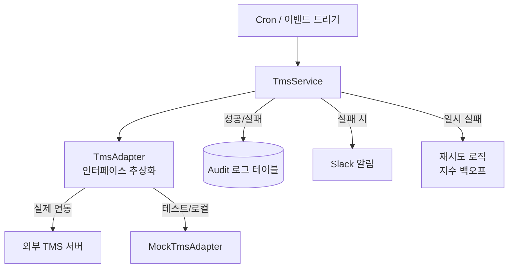
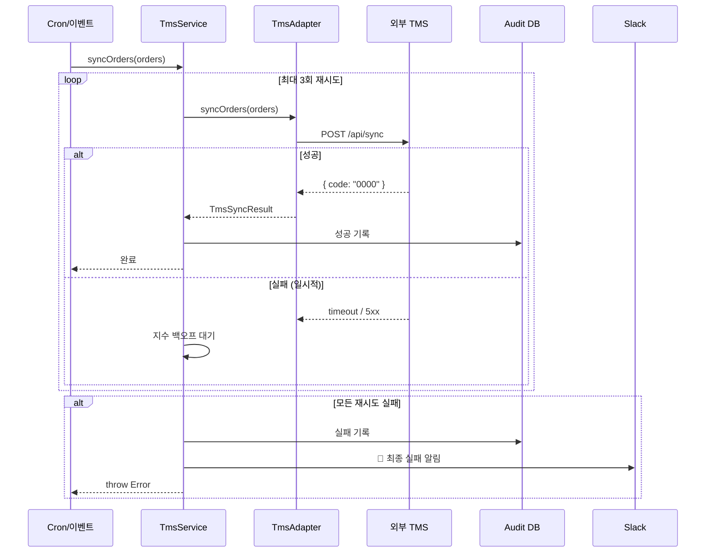

# 레거시 TMS 연동 개편 — 인터페이스 추상화와 재시도 설계

외부 운송관리시스템(TMS)과 연동하는 코드가 있었다. 누가 만들었는지 아무도 몰랐다. 주석도 없었다. 테스트도 없었다. 변수명은 `a`, `b`, `temp`였다.

그리고 돌아가고 있었다. 한 달에 3~5번 실패하는 것만 빼면.

실패하면 개발팀이 TMS 관리자 페이지에 직접 들어가서 수기로 처리했다. 매번 30분씩. 왜 실패했는지는 알 수 없었다. `catch`에서 `console.log(e)`만 찍고 끝이었으니까.

## 코드를 처음 열었을 때

실제 코드를 그대로 옮길 수는 없지만, 구조는 이랬다.

```typescript
async function syncTms(data: any) {
  const a = await db.query('SELECT * FROM orders WHERE ...');
  const b = a.map(x => ({ ...x, temp: x.field1 + x.field2 }));

  try {
    const res = await axios.post('http://tms-internal/api/sync', b);
    if (res.data.code === '0000') {
      // 성공
    }
    // 실패 케이스 처리 없음
  } catch (e) {
    console.log(e); // 로그만 찍고 끝
    // 재시도 없음, 알림 없음
  }
}
```

세 가지가 눈에 들어왔다.

`http://tms-internal/api/sync` — 내부 URL이라 로컬에서 실행하면 바로 에러가 난다. 테스트를 짜려면 실제 TMS 서버가 필요하다. 그러니 테스트가 없었던 거다.

`console.log(e)` — 실패해도 아무도 모른다. 운영팀이 "오늘 배송 처리가 안 됐어요"라고 연락이 와야 알았다.

`any` 범벅 — 어떤 데이터가 오가는지 알 수 없다. TMS API 스펙이 바뀌면 런타임에 `undefined is not a property of ...` 에러로 알게 된다.

## 한 번에 갈아엎지 않기로 했다

이 코드는 어떻게 동작하는지 파악하기 어려웠다. 잘못 건드리면 더 망가질 것 같았다. 그래서 기존 코드를 건드리지 않고 테스트할 수 있는 구조를 먼저 만들기로 했다.

방법은 인터페이스를 먼저 정의하고, 기존 동작을 인터페이스 뒤로 숨기는 것이었다.



## MockAdapter가 생기면 코드를 자신 있게 고칠 수 있다

```typescript
// tms.adapter.interface.ts
export interface ITmsAdapter {
  syncOrders(orders: TmsOrder[]): Promise<TmsSyncResult>;
  getStatus(orderId: string): Promise<TmsOrderStatus>;
}

// tms.adapter.ts — 실제 TMS 연동
@Injectable()
export class TmsAdapter implements ITmsAdapter {
  async syncOrders(orders: TmsOrder[]): Promise<TmsSyncResult> {
    const response = await this.httpClient.post('/api/sync', orders);
    return this.parseResponse(response.data);
  }
}

// mock-tms.adapter.ts — 로컬/테스트용
@Injectable()
export class MockTmsAdapter implements ITmsAdapter {
  async syncOrders(orders: TmsOrder[]): Promise<TmsSyncResult> {
    return { success: true, syncedCount: orders.length };
  }
}
```

NestJS DI로 환경에 따라 어댑터를 교체한다.

```typescript
@Module({
  providers: [
    {
      provide: ITmsAdapter,
      useClass: process.env.NODE_ENV === 'test'
        ? MockTmsAdapter
        : TmsAdapter,
    },
  ],
})
export class TmsModule {}
```

`NODE_ENV=test`로 실행하면 실제 TMS 서버 없이 전체 흐름을 테스트할 수 있다. MockAdapter를 만들고 나서부터 코드를 자신 있게 고칠 수 있었다.

## TMS 서버가 일시적으로 내려갈 때

TMS 서버가 일시적으로 내려가는 경우가 있었다. 즉시 실패 처리하면 수기 대응이 필요하다. 지수 백오프(Exponential Backoff)로 자동 재시도한다.

```typescript
@Injectable()
export class TmsService {
  private readonly MAX_RETRIES = 3;
  private readonly BASE_DELAY_MS = 1000;

  async syncWithRetry(orders: TmsOrder[]): Promise<void> {
    let lastError: Error;

    for (let attempt = 1; attempt <= this.MAX_RETRIES; attempt++) {
      try {
        const result = await this.tmsAdapter.syncOrders(orders);
        await this.auditLog.record({ orders, result, attempt });
        return;
      } catch (error) {
        lastError = error;
        const delay = this.BASE_DELAY_MS * Math.pow(2, attempt - 1);
        // 1초 → 2초 → 4초

        this.logger.warn(
          `TMS 동기화 실패 (시도 ${attempt}/${this.MAX_RETRIES}), ${delay}ms 후 재시도`,
          { error: error.message, ordersCount: orders.length },
        );

        if (attempt < this.MAX_RETRIES) {
          await sleep(delay);
        }
      }
    }

    // 모든 재시도 실패 → Slack 알림 + Audit 기록
    await this.auditLog.recordFailure({ orders, error: lastError });
    await this.slackNotifier.alert({
      title: 'TMS 동기화 최종 실패',
      message: `${orders.length}건 처리 실패: ${lastError.message}`,
      severity: 'error',
    });

    throw lastError;
  }
}
```

간격을 지수적으로 늘리는 이유가 있다. TMS 서버가 과부하 상태일 때 즉시 재시도하면 오히려 서버를 더 압박한다. 간격을 늘려서 서버가 회복할 시간을 준다.

## "이거 이미 처리됐나요?"에 즉시 답하기

기존에는 수기 대응 시 "이 주문이 TMS에 동기화됐는지"를 확인할 방법이 없었다. 모든 변경 작업을 Audit 로그로 남겼다.

```typescript
@Entity('tms_audit_log')
export class TmsAuditLog {
  @PrimaryGeneratedColumn('uuid')
  id: string;

  @Column('jsonb')
  requestPayload: TmsOrder[];   // 어떤 데이터를 보냈는지

  @Column('jsonb', { nullable: true })
  responsePayload: TmsSyncResult | null;  // TMS가 뭐라고 응답했는지

  @Column()
  status: 'SUCCESS' | 'FAILURE';

  @Column({ nullable: true })
  errorMessage: string | null;

  @Column()
  attemptCount: number;         // 몇 번 시도했는지

  @CreateDateColumn()
  createdAt: Date;
}
```

이제 "3일 전 오후 2시에 어떤 주문이 TMS에 동기화됐는지"를 DB에서 바로 조회할 수 있다.

## 전체 흐름



---

## 타입을 정의하면 컴파일러가 알려준다

기존 코드의 `any` 범벅을 타입으로 정리했다.

```typescript
export interface TmsOrder {
  orderId: string;
  customerId: string;
  deliveryAddress: TmsAddress;
  items: TmsOrderItem[];
  scheduledAt: Date;
}

export interface TmsSyncResult {
  success: boolean;
  syncedCount: number;
  failedOrderIds: string[];
  tmsReferenceId: string;  // TMS 측 참조 ID (Audit용)
}
```

타입을 정의하고 나니 TMS API 스펙 변경이 생겼을 때 어디를 고쳐야 하는지 컴파일러가 알려준다. 기존에는 런타임에 `undefined is not a property of ...` 에러로 알았다.

## 작업 이후

수기 대응은 사라졌다. 실패가 생기면 Slack으로 즉시 알림이 왔다. Audit 로그 덕분에 "이 주문 처리됐어요?"라는 질문에 DB 조회 한 번으로 답할 수 있었다.

그로부터 두 달쯤 지나서 TMS 쪽에서 또 문제가 생겼다. API 응답 스펙이 조용히 바뀌어 있었다. 그때는 런타임 에러가 아니라 컴파일 에러로 먼저 알았다.
