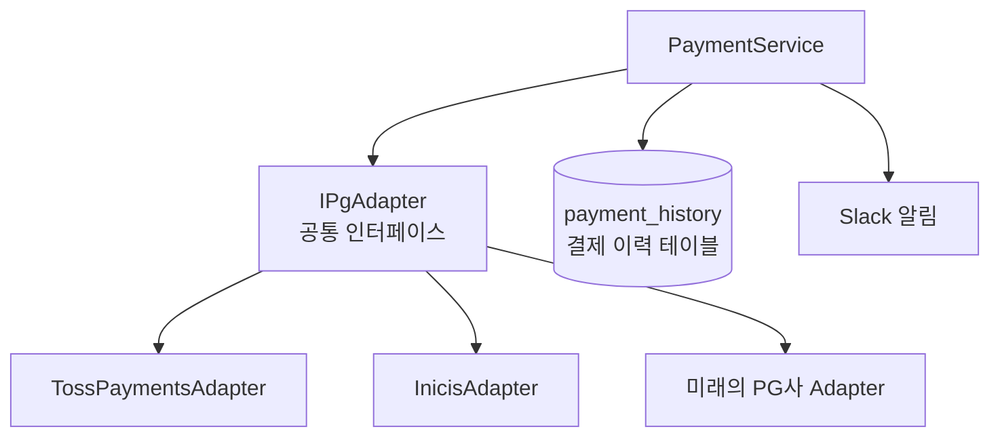
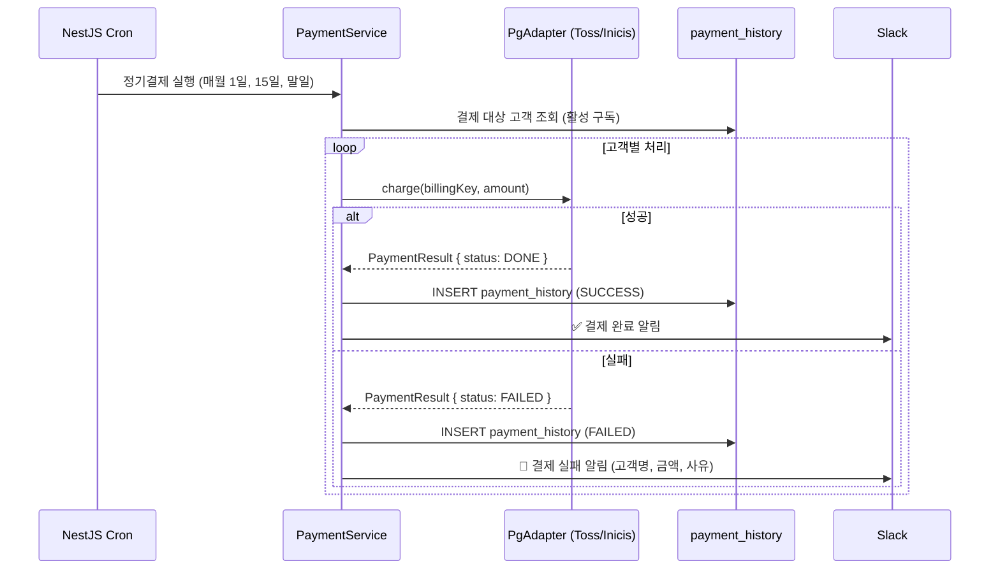

# 수기 결제 자동화 — 토스페이먼츠 정기결제와 PG 추상화 설계

매월 1일, 15일, 말일. 이 세 날짜에는 운영팀이 CMS 관리자 페이지를 열었다. 카드 정보를 직접 입력하고, 결제 버튼을 눌렀다. 고객 수만큼 반복했다. 한 번에 30분, 한 달에 세 번.

결제가 됐는지 확인하려면 CMS 화면을 다시 열어봐야 했다. 이력이 없었다. 고객이 "저 결제 됐나요?"라고 물어오면 관리자 페이지를 직접 확인하는 수밖에 없었다. 결제 실패가 나도 다음 작업 때 가서야 알았다. 스프레드시트에 수기로 기록하던 결제 이력은 언제나 한 박자 늦었다.

이 구조를 바꾸는 게 목표였다.

## PG사는 결국 바뀐다

설계를 시작하면서 "토스페이먼츠만 쓸 것"이라는 전제를 버렸다. PG사는 수수료, 정산 주기, 기능 지원 범위에 따라 바뀐다. 실제로 이니시스 도입이 예정돼 있었고, 그게 아니더라도 같은 판단을 했을 것이다.

토스페이먼츠에 직접 의존하는 코드를 짜면, PG사를 바꿀 때 결제 관련 코드 전체를 뜯어고쳐야 한다. 인터페이스 하나를 사이에 두면, 그 비용이 Adapter 하나 구현으로 줄어든다. 처음부터 교체 가능한 구조로 만드는 게 낫다는 건 결제 코드를 한 번이라도 고쳐본 사람이라면 안다.



## 공통 인터페이스 정의

```typescript
export interface IPgAdapter {
  /**
   * 정기결제 빌링키 발급
   * PG사마다 발급 방식이 다르지만, 결과는 동일한 BillingKey 형태로 반환
   */
  issueBillingKey(params: IssueBillingKeyParams): Promise<BillingKey>;

  /** 빌링키로 결제 실행 */
  charge(params: ChargeParams): Promise<PaymentResult>;

  /** 결제 취소 */
  cancel(params: CancelParams): Promise<CancelResult>;

  /** 결제 상태 조회 */
  getStatus(paymentKey: string): Promise<PaymentStatus>;
}

export interface PaymentResult {
  paymentKey: string;       // PG사 결제 고유 키
  orderId: string;
  amount: number;
  status: 'DONE' | 'FAILED' | 'CANCELED';
  approvedAt: Date;
  pgProvider: 'TOSS' | 'INICIS';
}
```

### 토스페이먼츠 Adapter

```typescript
@Injectable()
export class TossPaymentsAdapter implements IPgAdapter {
  async charge(params: ChargeParams): Promise<PaymentResult> {
    const response = await this.httpClient.post(
      `https://api.tosspayments.com/v1/billing/${params.billingKey}`,
      {
        customerKey: params.customerId,
        amount: params.amount,
        orderId: params.orderId,
        orderName: params.orderName,
      },
      {
        headers: {
          Authorization: `Basic ${Buffer.from(`${this.secretKey}:`).toString('base64')}`,
        },
      },
    );

    return {
      paymentKey: response.data.paymentKey,
      orderId: response.data.orderId,
      amount: response.data.totalAmount,
      status: response.data.status === 'DONE' ? 'DONE' : 'FAILED',
      approvedAt: new Date(response.data.approvedAt),
      pgProvider: 'TOSS',
    };
  }
}
```

### 이니시스 Adapter

이니시스는 토스페이먼츠와 API 스펙이 완전히 다르다. 인증 방식(HMAC 서명), 요청 파라미터, 응답 형태가 모두 다르다. 하지만 `IPgAdapter` 인터페이스를 구현하기 때문에 `PaymentService`는 어느 PG사인지 신경 쓰지 않는다.

```typescript
@Injectable()
export class InicisAdapter implements IPgAdapter {
  async charge(params: ChargeParams): Promise<PaymentResult> {
    const timestamp = Date.now().toString();
    const signature = this.generateHmac(params, timestamp);

    const response = await this.httpClient.post(
      'https://iniapi.inicis.com/api/v1/billing',
      {
        mid: this.merchantId,
        timestamp,
        signature,
        billkey: params.billingKey,
        price: params.amount,
        goodname: params.orderName,
      },
    );

    // 이니시스 응답을 공통 형태로 변환
    return {
      paymentKey: response.data.tid,        // 이니시스는 tid
      orderId: params.orderId,
      amount: params.amount,
      status: response.data.resultCode === '0000' ? 'DONE' : 'FAILED',
      approvedAt: new Date(),
      pgProvider: 'INICIS',
    };
  }
}
```

---

## 정기결제 자동화 흐름



## Audit 구조 — 결제 이력 테이블

```typescript
@Entity('payment_history')
export class PaymentHistory {
  @PrimaryGeneratedColumn('uuid')
  id: string;

  @Column()
  customerId: string;

  @Column()
  orderId: string;

  @Column('decimal', { precision: 10, scale: 2 })
  amount: number;

  @Column({ type: 'enum', enum: ['SUCCESS', 'FAILED', 'CANCELED'] })
  status: PaymentStatus;

  @Column({ type: 'enum', enum: ['TOSS', 'INICIS'] })
  pgProvider: PgProvider;

  @Column({ nullable: true })
  pgPaymentKey: string;       // PG사 결제 키 (환불·조회용)

  @Column({ nullable: true })
  failureReason: string;      // 실패 사유

  @Column('jsonb')
  rawResponse: object;        // PG사 원본 응답 (디버깅용)

  @CreateDateColumn()
  createdAt: Date;
}
```

`rawResponse`에 PG사 원본 응답을 통째로 저장한다. 나중에 "이 결제가 왜 실패했는지" 디버깅할 때, PG사 응답 원문이 있으면 원인 파악이 훨씬 빠르다. 스토리지 비용보다 디버깅 시간이 더 비싸다.

## PG사 선택 로직

```typescript
@Injectable()
export class PaymentService {
  constructor(
    @Inject('TOSS_PG') private readonly tossAdapter: IPgAdapter,
    @Inject('INICIS_PG') private readonly inicisAdapter: IPgAdapter,
  ) {}

  private selectAdapter(customer: Customer): IPgAdapter {
    switch (customer.pgProvider) {
      case 'TOSS': return this.tossAdapter;
      case 'INICIS': return this.inicisAdapter;
      default: throw new Error(`지원하지 않는 PG사: ${customer.pgProvider}`);
    }
  }

  async chargeSubscription(customer: Customer): Promise<void> {
    const adapter = this.selectAdapter(customer);

    try {
      const result = await adapter.charge({
        billingKey: customer.billingKey,
        amount: customer.subscriptionAmount,
        orderId: generateOrderId(),
        orderName: '구독 결제',
        customerId: customer.id,
      });

      await this.paymentHistoryRepo.save({
        customerId: customer.id,
        orderId: result.orderId,
        amount: result.amount,
        status: 'SUCCESS',
        pgProvider: result.pgProvider,
        pgPaymentKey: result.paymentKey,
        rawResponse: result,
      });

    } catch (error) {
      await this.paymentHistoryRepo.save({
        customerId: customer.id,
        status: 'FAILED',
        failureReason: error.message,
        rawResponse: error.response?.data ?? {},
      });

      await this.slackNotifier.alert({
        title: '정기결제 실패',
        message: `고객: ${customer.name}, 금액: ${customer.subscriptionAmount}원`,
        severity: 'error',
        metadata: { reason: error.message, pgProvider: customer.pgProvider },
      });
    }
  }
}
```

새 PG사를 추가할 때 `PaymentService` 비즈니스 로직은 건드리지 않는다. `NewPgAdapter implements IPgAdapter`를 구현하고, 모듈에 provider를 등록하고, `selectAdapter()`에 case 한 줄을 추가하면 끝이다. `payment_history` 테이블 구조, Slack 알림 로직, Cron 스케줄러는 그대로다.

---

## Audit 없이 결제 운영은 불가능하다

자동화 이후 수기 작업은 사라졌다. 결제 이력은 DB에 자동으로 쌓이고, 실패는 Slack으로 즉시 올라온다. 고객이 "저 결제 됐나요?"라고 물어오면 DB를 조회하면 된다.

그런데 이 구조에서 진짜 중요한 건 Cron이나 Adapter가 아니라 `payment_history`다. 결제 이력이 없으면 고객 분쟁, 정산 검증, 장애 디버깅 모두 막막해진다. 어떤 PG사를 쓰든, 어떤 방식으로 결제를 처리하든, 모든 결제 행위는 기록으로 남아야 한다. 이건 설계 원칙이 아니라 운영 경험에서 나온 확신이다.
