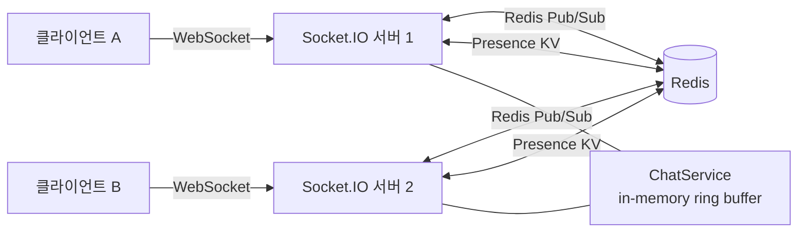

# 수평 확장 가능한 실시간 채팅·현재상태 시스템 설계

---

Slack 스타일의 "Alice is typing..." 인디케이터와 실시간 온라인/자리비움/오프라인 상태를 폴링 없이 구현하려면 어떻게 해야 할까.

단일 서버라면 쉽다. 문제는 서버가 여러 대일 때다. 클라이언트 A가 서버 1에 연결돼 있고, 클라이언트 B가 서버 2에 연결돼 있으면 — A가 보낸 메시지를 B가 받으려면 서버 1과 서버 2가 통신해야 한다.

**스택**: Node.js 20 · TypeScript · Socket.IO 4 · Redis 7 · Express

---

## 아키텍처



Redis 어댑터(`@socket.io/redis-adapter`)가 여러 서버 인스턴스 간에 소켓 룸을 공유한다. 어느 노드가 메시지를 받아도 다른 노드에 연결된 클라이언트에게 브로드캐스트할 수 있다.

---

## 설계 결정 3가지

### 인메모리 메시지 저장 + 링 버퍼 캡

`ChatService`는 룸당 최근 100개 메시지를 `Map<roomId, Message[]>`에 보관한다. 배열이 100개를 넘으면 가장 오래된 항목을 제거한다. 내구성을 포기하고 단순성을 택한 트레이드오프다.

프로덕션에서는 Redis Streams나 시계열 DB로 영속성과 재생(replay)을 확보해야 한다.

### Redis Presence + TTL

각 사용자 현재상태는 `presence:{userId}` 키에 60초 TTL로 저장된다. 서버가 `EXPIRE`를 호출해 하트비트를 유지한다. 연결 해제 시 항목을 삭제하지 않고 `offline`으로 업데이트한다 — `lastSeen`을 UI에 표시하기 위해서다.

```
presence:user123 = { status: "online", lastSeen: "2026-02-22T10:00:00Z" }
TTL: 60초 (서버 하트비트로 갱신)
```

### 브로드캐스트 vs 룸 emit

`presence:update`(온라인/오프라인/자리비움)는 전역 브로드캐스트(`socket.broadcast.emit`)로 모든 연결된 클라이언트에게 전달한다. `message:new`와 `typing:update`는 룸 범위(`io.to(roomId).emit`)로 제한한다.

이 구분이 스케일에서 중요하다. 전역 브로드캐스트는 룸 수에 선형적으로 팬아웃되지 않는다.

---

## 테스트 전략

17개 통합 테스트가 실제 Redis 인스턴스에 대해 실행된다.

- **HTTP API 테스트** — `supertest`로 Express 라우트 검증 (헬스, 룸 CRUD, 메시지 이력)
- **WebSocket 테스트** — 시나리오당 `socket.io-client` 연결 2개; 하나가 행동하고 다른 하나가 관찰
- **Redis Presence 테스트** — 실제 Redis로 `PresenceService` 메서드 직접 호출

목(mock) 없음. Redis가 다운되면 테스트가 실패한다 — 통합 테스트 스위트에서 올바른 동작이다.

---

## 보안 및 운영

- **멀티스테이지 Docker 빌드**: builder가 전체 의존성 설치 → runtime이 `dist/`와 프로덕션 의존성만 복사 → 최종 이미지 136MB (단순 빌드 ~400MB 대비)
- **컨테이너 내 non-root 사용자**: `adduser -S appuser`
- **`npm ci --ignore-scripts`**: CI에서 악성 라이프사이클 스크립트 방지
- 프로덕션 의존성 취약점 0개

---

## 프로덕션에서 바꿀 것들

| 갭 | 해결책 |
|---|---|
| 재시작 시 인메모리 메시지 유실 | Redis Streams 또는 PostgreSQL |
| 인증 없음 | `authenticate` 이벤트에 JWT 또는 세션 토큰 |
| 레이트 리밋 없음 | `express-rate-limit` + Socket.IO 소켓별 리미터 |
| Presence TTL이 서버 하트비트에 의존 | 클라이언트 측 30초마다 하트비트 emit |
| 베이스 이미지 고정 없음 | `node:20.18.0-alpine3.20@sha256:...` 형태로 고정 |

---

## 핵심 인사이트

수평 확장의 핵심은 **상태를 서버 밖으로 꺼내는 것**이다. 메시지 라우팅(Redis Pub/Sub)과 현재상태(Redis KV)를 Redis로 옮기면, 서버 인스턴스는 완전히 상태 없는(stateless) 컨슈머가 된다. 어느 서버가 요청을 받아도 동일하게 처리할 수 있다.

Socket.IO의 Redis 어댑터는 이 패턴을 룸 기반 브로드캐스트에 적용한 구현이다. 직접 구현하면 "왜 Redis가 필요한가"를 이해하게 된다.
