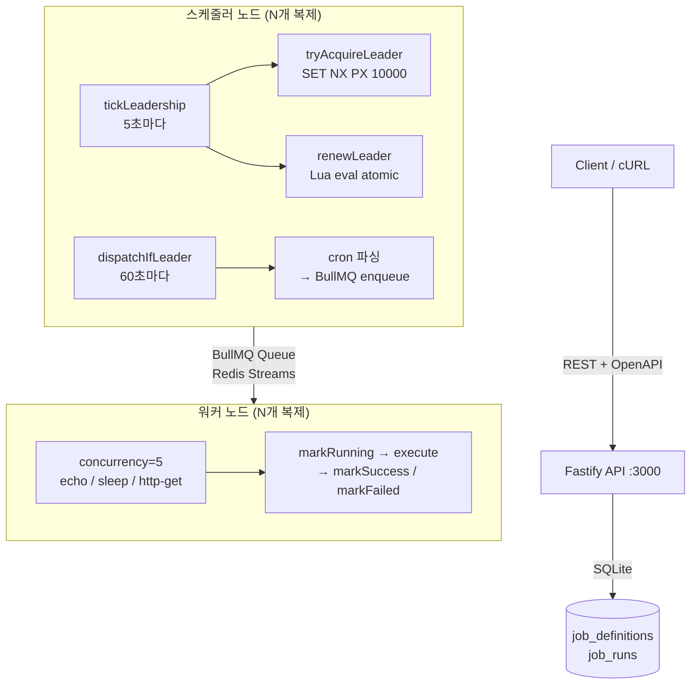

# Redis 리더 선출로 분산 크론 스케줄러 만들기

---

대부분의 프로덕션 시스템은 AWS EventBridge나 GCP Cloud Scheduler 같은 매니지드 스케줄러를 쓴다. 편리하지만 핵심 문제를 추상화해버린다.

**스케줄러 인스턴스가 10개 동시에 깨어나면 어떻게 중복 실행을 막는가?**

이 질문에 직접 답하기 위해 TypeScript ~700줄로 수평 확장 가능한 크론 스케줄러를 구현했다.

---

## 아키텍처



---

## 핵심 문제: 리더 선출

스케줄러 인스턴스가 여러 개 뜨면 모두 동시에 DB를 스캔해서 같은 잡을 큐에 넣는다. 중복 실행이 발생한다.

해결책은 Redis 분산 락이다.

```
SET cron:leader <nodeId> PX 10000 NX
```

`NX`(set-if-not-exists)를 이기는 노드가 하나뿐이다. 승자가 10초 동안 락을 보유하고, 5초마다 Lua 스크립트로 원자적으로 갱신한다.

```lua
if redis.call('GET', KEYS[1]) == ARGV[1] then
  return redis.call('PEXPIRE', KEYS[1], ARGV[2])
end
return 0
```

이 스크립트는 단일 Redis 명령으로 실행된다(원자적). 리더가 크래시하면 TTL이 10초 내에 만료되고 대기 노드가 리더를 이어받는다. 스플릿 브레인(Split-Brain, 두 노드가 동시에 리더라고 착각하는 상황)이 없다.

---

## 다운타임 후 누락된 잡 처리

스케줄러가 다운타임 후 재시작하면 그동안 놓친 잡을 실행해야 한다. 슬라이딩 윈도우로 처리한다.

```
windowStart = now − SCHEDULER_INTERVAL (60초)
fromDate    = max(lastScheduledAt, windowStart)

cronParser.parseExpression(cron, { currentDate: fromDate, endDate: now })
  .next() → 모든 due 슬롯 순회 → 각각 enqueue
```

각 크론 틱은 결정론적 `jobId = "${jobDefId}:${scheduledAt.toISOString()}"` 로 큐에 들어간다. BullMQ는 같은 ID의 잡을 자동으로 중복 제거한다. 엣지 케이스로 두 스케줄러 노드가 동시에 리더가 되더라도, 큐에는 정확히 하나의 실행만 남는다.

---

## 큐 + 워커 설계

BullMQ는 내부적으로 Redis Streams를 사용한다. 워커는 상태 없는 컨슈머다.

- **컨커런시**: 워커 인스턴스당 5개 잡 동시 처리 (설정 가능)
- **재시도**: BullMQ가 지수 백오프 처리; 워커는 각 시도 경계에서 실행 상태를 업데이트
- **핸들러**: 플러그인 방식 — `echo`, `sleep`, `http-get` 내장; 이름으로 추가 가능

잡 라이프사이클은 SQLite에 추적된다: `pending → running → success | failed | retrying`

---

## API

| 메서드 | 경로 | 설명 |
|--------|------|------|
| POST | `/jobs` | 잡 정의 생성 |
| GET | `/jobs` | 전체 잡 목록 |
| GET | `/jobs/:id` | 잡 + 최근 실행 이력 |
| PATCH | `/jobs/:id` | 상태 변경 (일시정지/재개) |
| DELETE | `/jobs/:id` | 소프트 삭제 |
| GET | `/jobs/:id/runs` | 페이지네이션된 실행 이력 |
| GET | `/health` | 헬스 체크 |
| GET | `/docs` | Swagger UI |

---

## 프로덕션에서 바꿀 것들

이 구현은 핵심 메커니즘을 이해하기 위한 설계다. 실제 프로덕션에서는 다음을 바꿔야 한다.

| 항목 | 현재 | 프로덕션 권장 |
|---|---|---|
| 스토리지 | SQLite | PostgreSQL (동시 쓰기 처리) |
| 리더 선출 | 단일 Redis 노드 락 | Redlock (단일 장애점 제거) |
| 복잡한 워크플로우 | 크론만 지원 | Temporal (팬아웃, 조건부 체인) |
| 실패 잡 | SQLite에만 저장 | Dead Letter Queue |
| 메트릭 | 없음 | Prometheus (enqueue rate, 실행 레이턴시, 실패율) |

---

## 수치

- **코드베이스**: TypeScript ~700줄 (src/), 테스트 ~200줄
- **Docker 이미지**: ~140MB (Node 20 Alpine, 프로덕션 의존성만, non-root)
- **테스트**: 단위 테스트 4개 (스케줄러 + 레포지토리 순수 로직)
- **의존성**: Fastify, BullMQ, ioredis, better-sqlite3, cron-parser, nanoid, zod, pino

---

## 왜 직접 만들었나

매니지드 스케줄러는 "중복 실행을 어떻게 막는가"라는 질문을 추상화해버린다. 직접 구현하면 분산 락의 TTL이 왜 필요한지, 원자적 갱신이 왜 Lua 스크립트여야 하는지, 결정론적 잡 ID가 왜 중복 제거를 보장하는지를 몸으로 이해하게 된다.

"어떻게 동작하는지 완전히 이해하고 어느 방향으로든 확장할 수 있는 것" — 그게 이 프로젝트의 목표였다.
