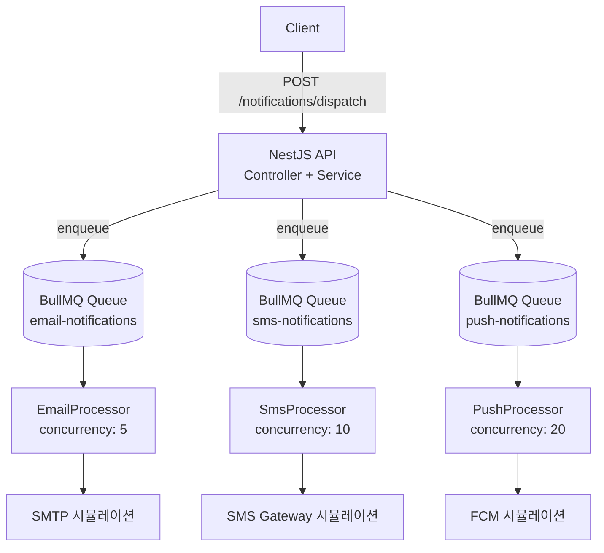

# 알림 채널 3개를 독립 큐로 분리한 이유

---

알림 시스템은 거의 모든 서비스에 들어가지만, 막상 직접 설계하면 함정이 많다.

- "Fire and forget"으로 HTTP 요청만 날리면 → 외부 API 장애 시 알림 유실
- 동기 처리로 응답 대기하면 → API 레이턴시가 외부 SMTP/FCM 레이턴시에 종속
- 채널을 하나의 큐로 묶으면 → SMS 폭증이 Email 처리를 막는 Head-of-Line Blocking

이 세 가지 문제를 **채널 분리 큐 + BullMQ 우선순위 + 지수 백오프**로 해결하는 구조를 설계했다.

---

## 아키텍처



---

## 핵심 설계 결정 3가지

### 1. 채널별 독립 큐

Email · SMS · Push를 각각 별도 BullMQ 큐로 분리했다. 채널마다 외부 API 특성이 다르기 때문이다.

| 채널 | 레이턴시 특성 | 워커 컨커런시 |
|------|-------------|------------|
| Email (SMTP) | 10~50ms | 5 |
| SMS (Gateway) | 5~30ms | 10 |
| Push (FCM) | 2~15ms | 20 |

FCM은 빠르고 연결 제한이 느슨하므로 높은 컨커런시를 허용한다. SMTP는 커넥션 풀이 제한적이므로 낮게 설정한다. 하나의 큐를 쓰면 이런 채널별 튜닝이 불가능하다.

### 2. 4단계 우선순위 매핑

BullMQ의 `priority` 옵션은 낮은 숫자가 높은 우선순위다.

```typescript
const PRIORITY_MAP: Record<NotificationPriority, number> = {
  CRITICAL: 1,  // 계정 보안 알림, 결제 오류
  HIGH:     2,  // 주문 확인, OTP
  NORMAL:   3,  // 일반 트랜잭션
  LOW:      4,  // 뉴스레터, 마케팅
};
```

`CRITICAL` 알림은 큐 앞으로 즉시 이동하여 `LOW` 마케팅 메일이 밀려 있어도 먼저 처리된다.

### 3. 지수 백오프 재시도

외부 API 장애는 일시적인 경우가 많다. 즉시 재시도보다 점진적 대기가 성공률을 높인다.

```typescript
await queue.add(`send-${channel}`, payload, {
  attempts: 3,
  backoff: { type: 'exponential', delay: 1000 },
  // 1차 실패 → 1초 후 재시도
  // 2차 실패 → 2초 후 재시도
  // 3차 실패 → Dead Letter Queue
});
```

Email 워커에 5% 확률 SMTP 타임아웃을 시뮬레이션했는데, 재시도 덕분에 부하 테스트 200건에서 **최종 실패 0건**이었다.

---

## 구현 포인트

### DTO 유효성 검사

```typescript
export class SendNotificationDto {
  @IsArray()
  @ArrayNotEmpty()
  @IsEnum(NotificationChannel, { each: true })
  channels: NotificationChannel[];     // ['email', 'sms', 'push'] 조합

  @IsString()
  recipient: string;

  @IsEnum(NotificationPriority)
  @IsOptional()
  priority?: NotificationPriority = NotificationPriority.NORMAL;
}
```

`whitelist: true` + `transform: true` ValidationPipe 조합으로 정의되지 않은 필드는 자동 제거된다.

### 다채널 병렬 enqueue

```typescript
const promises = dto.channels.map(async (channel) => {
  const queue = this.getQueue(channel);
  const job = await queue.add(`send-${channel}`, payload, options);
  jobIds[channel] = job.id!;
});

await Promise.all(promises);  // 3개 큐에 동시 enqueue
```

`Promise.all`로 채널 수와 무관하게 일정한 응답 시간을 유지한다. 3채널 요청도 가장 느린 채널 하나의 Redis 왕복 시간만 기다린다.

---

## 성능 벤치마크

**환경**: macOS, Node.js 20, Redis 7 (로컬)

```
Requests:    200
Concurrency: 20
Channels:    email + sms + push (총 600 jobs)
Duration:    332ms
RPS:         602
p50:         26ms
p95:         53ms
p99:         71ms
Failures:    0
```

### 결과 해석

- **602 RPS**: API 응답 시간 = Redis enqueue 시간만 포함. 실제 발송(SMTP, FCM)은 워커가 비동기로 처리하므로 API 레이턴시와 무관.
- **p95 53ms**: Redis 왕복 × 3채널 + NestJS 라우팅 오버헤드. 충분히 낮다.
- **0 failures**: 재시도 정책이 일시적 오류를 완전히 흡수했다.

---

## 큐 상태 모니터링

`GET /notifications/stats` 로 실시간 큐 상태를 확인할 수 있다.

```json
{
  "queues": [
    { "name": "email", "waiting": 0, "active": 2, "completed": 200, "failed": 0 },
    { "name": "sms",   "waiting": 0, "active": 5, "completed": 200, "failed": 0 },
    { "name": "push",  "waiting": 0, "active": 10, "completed": 200, "failed": 0 }
  ],
  "timestamp": "2026-02-22T07:54:00.000Z"
}
```

`active` 값이 높으면 워커 컨커런시를 늘리거나 외부 API 병목을 점검한다. `failed`가 증가하면 외부 API 장애 신호다.

---

## 테스트 전략

### 단위 테스트 (9개)

NestJS `@nestjs/testing`으로 Queue를 목(mock) 처리하여 Redis 없이 빠르게 검증:

```typescript
const makeQueueMock = () => ({
  add: jest.fn().mockResolvedValue({ id: 'mock-job-id' }),
  getWaitingCount: jest.fn().mockResolvedValue(0),
});
```

핵심 케이스:
- 채널별 올바른 Queue에 enqueue
- CRITICAL → priority 1, LOW → priority 4 매핑
- 3채널 동시 enqueue 동작
- `enqueuedAt` ISO 포맷 검증

---

## 운영 고려사항

| 항목 | 현재 설정 | 프로덕션 권장 |
|------|---------|------------|
| Redis 구성 | 단일 노드 | Sentinel / Cluster |
| 완료 잡 보존 | 최근 100건 | 외부 스토리지 또는 증분 카운터 |
| 워커 프로세스 | 단일 프로세스 | 별도 Worker 프로세스 분리 |
| 외부 API 연동 | 시뮬레이션 | 실제 SMTP / Twilio / FCM 연동 |
| 메트릭 노출 | JSON 엔드포인트 | Prometheus + Grafana |

---

## "알림 유실 없이, API 레이턴시 최소로"

BullMQ는 "단순한 큐 라이브러리"처럼 보이지만, 우선순위·재시도·컨커런시를 조합하면 꽤 복잡한 알림 흐름을 우아하게 처리할 수 있다. NestJS의 `@Processor` + `WorkerHost` 패턴은 채널별 워커를 모듈로 캡슐화하여 코드 분리도 깔끔하다.

채널 분리의 핵심 이유는 **Head-of-Line Blocking 방지**다. 하나의 큐에 모든 채널을 넣으면 느린 채널이 빠른 채널을 막는다. 독립 큐는 각 채널이 자신의 속도로 처리되도록 보장한다.
