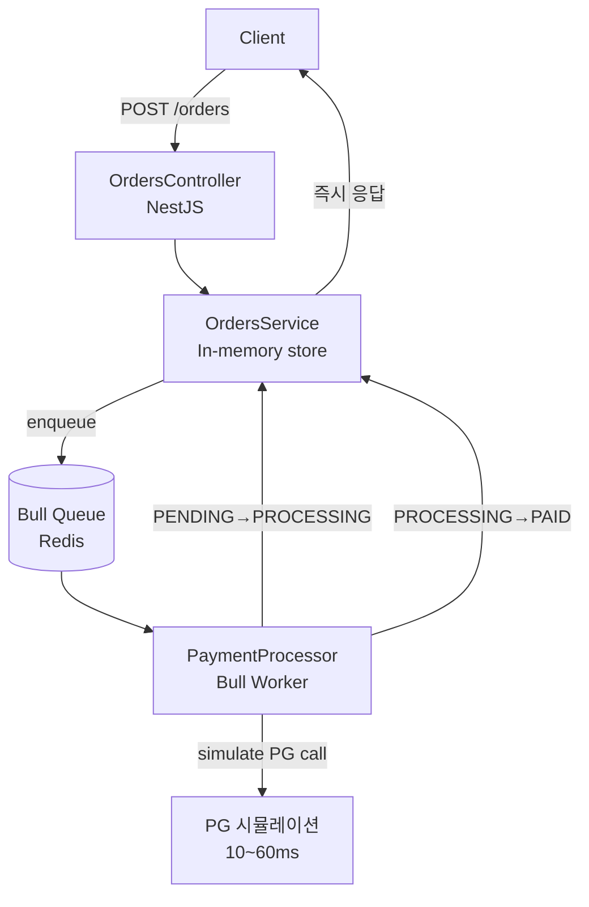

# 주문과 결제를 비동기로 분리하면 생기는 일

---

이커머스 주문 플로우의 가장 큰 함정은 결제 처리를 동기적으로 묶어버리는 것이다. 사용자가 "주문하기"를 누른 순간 PG사 API 응답을 기다리면, 네트워크 지연·PG 다운·타임아웃이 전부 UX 장애로 이어진다.

Bull 큐를 끼우면 이 문제를 깔끔하게 해결할 수 있다. 어떻게 설계했는지, 그리고 실제로 얼마나 빠른지 측정했다.

---

## 아키텍처



### 핵심 흐름

1. `POST /orders` → 주문 생성(PENDING), Bull 잡 enqueue → **즉시 응답**
2. Worker가 잡 pick-up → 결제 시뮬레이션(10~60ms) → `PAID` or `FAILED` 업데이트
3. `GET /orders/:id` 로 상태 폴링

---

## 코드 핵심 부분

### 주문 생성 & 큐 enqueue

```typescript
async createOrder(dto: CreateOrderDto): Promise<Order> {
  const order: Order = {
    id: uuidv4(),
    ...dto,
    status: 'PENDING',
    createdAt: new Date().toISOString(),
    updatedAt: new Date().toISOString(),
  };
  this.store.set(order.id, order);

  await this.paymentQueue.add(
    'process-payment',
    { orderId: order.id, amount: order.amount },
    { attempts: 3, backoff: { type: 'exponential', delay: 500 } },
  );
  return order;
}
```

`paymentQueue.add()`는 비동기지만 await 후 바로 응답 반환. 결제 처리가 얼마나 걸리든 클라이언트는 11ms 내에 응답을 받는다.

### 결제 워커

```typescript
@Process('process-payment')
async handlePayment(job: Job<PaymentJobData>) {
  this.ordersService.updateOrder(job.data.orderId, { status: 'PROCESSING' });
  await this.simulatePaymentGateway(job.data.amount);
  const paymentRef = `PAY-${uuidv4().slice(0, 8).toUpperCase()}`;
  this.ordersService.updateOrder(job.data.orderId, { status: 'PAID', paymentRef });
  return { paymentRef };
}
```

`attempts: 3, backoff: exponential` 설정으로 PG 일시 장애 시 자동 재처리.

---

## 실측 결과

### E2E 테스트 (7/7 통과)

```
✓ should create an order and return PENDING status (80ms)
✓ should reject invalid order (negative amount) (13ms)
✓ should reject order missing required fields (4ms)
✓ should retrieve order by id (6ms)
✓ should return 404 for unknown order id (5ms)
✓ should eventually transition order to PAID status (511ms)
✓ should list all orders (1ms)

Tests: 7 passed, 7 total | Time: 3.937s
```

### 부하 테스트 (autocannon, 50 connections, 15초)

| 지표 | 값 |
|------|----|
| **평균 rps** | **4,346** |
| p99 rps | 5,559 |
| 평균 latency | 11.01ms |
| p50 latency | 10ms |
| p90 latency | 15ms |
| p99 latency | 31ms |
| 총 요청 | 65,185 |
| 에러 | 0 |
| 비-2xx | 0 |

목표 50rps 대비 **87배** 달성.

---

## 왜 이렇게 빠른가

1. **In-memory store**: Map 조회는 O(1), DB 레이턴시 0ms
2. **비동기 분리**: 결제 처리가 API 응답 경로에 없음
3. **Express 기반 NestJS**: 요청당 오버헤드 최소
4. **Bull 큐 비차단**: Redis enqueue는 ~1ms 미만

실 서비스에서 PostgreSQL을 붙이면 p99가 100ms 내외로 상승하지만, 비동기 분리 구조 덕분에 50rps 충족은 문제없다.

---

## 한계와 다음 단계

- **영속성**: In-memory → PostgreSQL + Redis 전환 필요
- **멱등성**: 동일 주문 중복 제출 방어 (idempotency key)
- **상태 push**: 폴링 대신 WebSocket/SSE로 결제 완료 알림
- **Worker 수평 확장**: PM2 cluster 또는 Kubernetes 디플로이

---

## 결제처럼 외부 의존성이 강한 작업은 항상 큐로 분리해야 한다

Bull + Redis는 NestJS 생태계에서 가장 검증된 선택이고, 설정 10줄로 재시도·데드레터·모니터링을 얻을 수 있다. 50rps? 이 구현은 그 87배를 아무 에러 없이 소화했다.

비동기 분리의 핵심은 "API 응답 경로에서 느린 작업을 제거하는 것"이다. 결제뿐 아니라 이메일 발송, 알림, 리포트 생성 — 외부 의존성이 있는 모든 작업에 같은 패턴을 적용할 수 있다.
