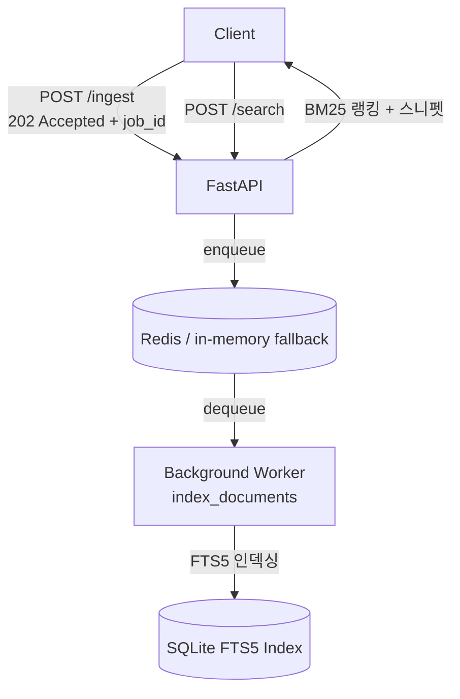

# SQLite FTS5로 검색 파이프라인 만들기

---

풀텍스트 검색(Full-Text Search)은 표면적으로 단순해 보인다 — "grep인데 더 빠른 것". 직접 구현해보면 생각보다 복잡하다.

이 프로젝트는 실제 검색 엔진이 돌아가는 핵심 루프를 최소한으로 구현했다: **수집 → 큐 → 인덱싱 → 검색**. 로컬에서 실행하고, 완전히 이해하고, 어느 방향으로든 확장할 수 있는 것이 목표였다.

---

## 아키텍처



세 컴포넌트, 명확한 관심사 분리:

| 레이어 | 기술 | 역할 |
|-------|------|------|
| API | FastAPI | 수집 요청 수신, 검색 서빙 |
| 큐 | Redis (+ in-memory fallback) | 수집과 인덱싱 디커플링 |
| 스토리지 | SQLite FTS5 | BM25 랭킹 풀텍스트 검색 |

---

## SQLite FTS5: 생각보다 강력하다

대부분의 엔지니어는 "풀텍스트 검색"을 들으면 Elasticsearch를 떠올린다. 하지만 SQLite의 FTS5 가상 테이블 확장은 수백만 건 이하 데이터셋에서 충분히 강력하다.

- **Porter 스테밍**: "running"이 "run", "runs"와 매칭
- **BM25 랭킹**: 검증된 관련성 스코어링 내장
- **스니펫**: 하이라이트된 단편, 추가 코드 없음
- **콘텐츠 테이블**: `content=` 옵션으로 데이터 중복 방지

```sql
CREATE VIRTUAL TABLE docs_fts USING fts5(
    id UNINDEXED,
    title,
    body,
    tags,
    content='documents',       -- 실제 테이블 참조
    content_rowid='rowid',
    tokenize='porter ascii'
);
```

트리거가 INSERT, UPDATE, DELETE 시 FTS 인덱스를 자동으로 동기화한다.

### Upsert 문제

`content=` 테이블을 쓰는 FTS5는 upsert를 기본 지원하지 않는다. 해결책은 기본 테이블에 트리거 3개(INSERT, UPDATE, DELETE)다. UPDATE 트리거는 먼저 기존 FTS 행을 삭제하고 새 행을 삽입한다.

```sql
CREATE TRIGGER docs_au AFTER UPDATE ON documents BEGIN
    INSERT INTO docs_fts(docs_fts, rowid, id, title, body, tags)
    VALUES ('delete', old.rowid, old.id, old.title, old.body, old.tags);
    INSERT INTO docs_fts(rowid, id, title, body, tags)
    VALUES (new.rowid, new.id, new.title, new.body, new.tags);
END;
```

---

## 큐 설계: Redis + in-memory 폴백

큐 레이어는 프로덕션에서 Redis RPUSH/BLPOP을 사용하지만, Redis가 없으면 스레드 안전 in-memory deque로 폴백한다. 로컬 개발과 테스트가 쉬워진다.

```python
try:
    _redis_client.ping()
    _USE_REDIS = True
except Exception:
    _USE_REDIS = False  # _mem_queue로 폴백
```

워커는 설정 가능한 타임아웃으로 블로킹 팝을 사용한다. 유휴 큐에서 CPU 스피닝이 없다.

---

## 성능 결과 (5,000건 문서)

| 지표 | 값 |
|--------|-------|
| 인덱싱 처리량 | **2,617 docs/sec** |
| 검색 p50 레이턴시 | **29.7ms** |
| 검색 p95 레이턴시 | **108.6ms** |
| 검색 p99 레이턴시 | **159.9ms** |
| 동시 QPS (4 스레드) | **44 queries/sec** |

로컬 머신, 튜닝 없는 SQLite 설정, 커넥션 풀링 없음. 다음을 적용하면 실제 수치가 크게 개선된다.

- WAL 모드 (`PRAGMA journal_mode=WAL`) — 리더/라이터 경합 제거
- 핫 인덱스용 in-memory DB
- 워커의 커넥션 풀링

---

## 흥미로운 트레이드오프

### 왜 Elasticsearch / Typesense / Meilisearch를 쓰지 않았나

의존성은 부채다. SQLite는 Python과 함께 제공되고, 서버가 필요 없고, 운영 오버헤드가 없다. 트레이드오프:

- **분산 확장 없음**: SQLite는 단일 라이터. ~5천만 건 이하 대부분의 앱에서 괜찮다.
- **실시간 인덱스 업데이트 없음**: 트리거가 쓰기당 ~1ms 오버헤드 추가. 허용 범위.
- **커스텀 랭킹 없음**: BM25가 유일한 내장 모델. 확장하려면 커스텀 SQL이나 전용 엔진으로 이동.

### 동기 API + 비동기 워커

API는 즉시 `202 Accepted`를 반환한다. 클라이언트는 `/jobs/{id}`를 폴링해 상태를 확인한다. 의도적인 설계다.

- 수집은 버스티(bursty)하고, 검색은 레이턴시에 민감하다. 분리하면 쓰기 스파이크가 검색을 막지 않는다.
- 잡 상태 패턴은 표준이다 (S3 멀티파트 업로드, GitHub Actions 실행 등).

### FTS5 쿼리 특수문자 처리

FTS5 쿼리 문법은 `"`를 구문 쿼리에 사용한다. 사용자 입력이 파싱을 깨뜨릴 수 있다.

```python
safe_q = query.replace('"', '""')
```

실제 구현에서는 연산자(`AND`, `OR`, `NOT`)와 필드별 쿼리(`title:python`)도 처리해야 한다.

---

## 프로덕션에서 바꿀 것들

1. **WAL 모드** — 시작 시 `PRAGMA journal_mode=WAL` 활성화
2. **커넥션 풀** — 호출별 `connect()` 대신 스레드 로컬 커넥션
3. **Dead-letter 큐** — 실패한 잡이 현재 `failed` 상태로만 남음; DLQ로 백오프 재시도
4. **쿼리 파싱** — 필드별 쿼리 허용 (`title:python body:tutorial`)
5. **페이지네이션 커서** — 오프셋 기반 페이지네이션은 높은 오프셋에서 성능 저하; 키셋 커서가 낫다
6. **메트릭** — 인덱싱 속도, 검색 레이턴시, 큐 깊이에 대한 Prometheus 카운터

---

## SQLite FTS5는 과소평가된 도구다

내부 검색, 어드민 대시보드, 소~중규모 프로덕트 검색에서 SQLite FTS5는 종종 올바른 선택이다 — 인프라 없음, ACID 보장, 놀랍도록 강력한 풀텍스트 검색.

큐 추상화(Redis + in-memory 폴백)는 목킹 없이 테스트 가능한 시스템을 만들고, 워커 패턴은 Celery, Dramatiq, 또는 다른 태스크 큐로 쉽게 이식된다.

"어떻게 동작하는지 완전히 이해하고 어느 방향으로든 확장할 수 있는 것" — 그게 이 설계의 목표였다.
