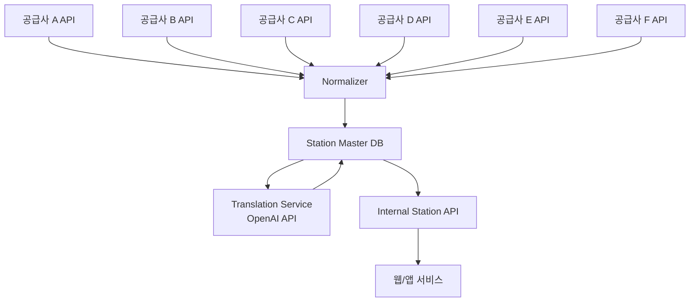
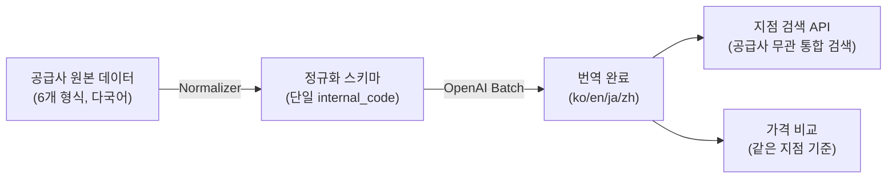
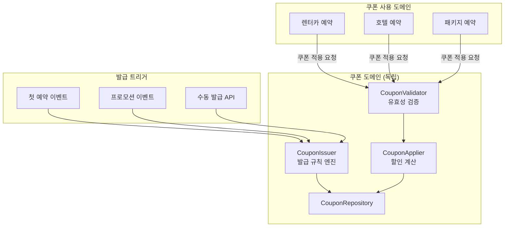

# 인천공항이 네 가지 이름으로 저장된 이유 — 공급사 데이터 정규화

---

공급사 데이터를 처음 들여다봤을 때 이런 걸 발견했다.

```
공급사 A: { "loc_code": "ICN01", "loc_name": "Incheon Airport T1" }
공급사 B: { "station_id": "KR-ICN-T1", "station_name": "인천공항 제1터미널" }
공급사 C: { "id": 4821, "name": "仁川国際空港 T1", "city": "Incheon" }
공급사 D: { "pickup_point": "ICNT1", "description": "Incheon Intl Airport Terminal 1" }
```

같은 "인천공항 1터미널"이 공급사마다 다른 이름으로 저장돼 있었다. 이 상태로는 사용자에게 "인천공항에서 픽업 가능한 공급사"를 보여줄 수 없었다. 공급사 간 가격 비교도 불가능했다. 지점 검색이 공급사별로 따로 동작했다.

쿠폰 문제는 다른 방향에서 터졌다. 호텔 상품이 추가되면서 "호텔에도 쿠폰을 적용하고 싶다"는 요구가 생겼는데, 쿠폰 로직이 렌터카 예약 서비스 코드 안에 박혀 있었다. 건드리는 게 무서웠다.

두 문제는 달라 보이지만 본질은 같았다. 흩어진 걸 정규화하고, 강결합된 걸 분리하는 것.

---

## 6개 공급사 지점 데이터를 하나로

### 정규화 스키마 설계

핵심은 **공급사 코드와 내부 코드를 분리**하는 것이었다. 공급사가 어떤 형식을 쓰든 내부에서는 단일 `internal_code`로 관리한다.



```sql
-- 정규화된 지점 마스터 테이블
CREATE TABLE stations (
  id            UUID PRIMARY KEY,
  internal_code VARCHAR(50) UNIQUE,  -- 내부 표준 코드 (예: KR-ICN-T1)
  iata_code     VARCHAR(10),         -- 공항 IATA 코드 (있는 경우)
  city          VARCHAR(100),
  country_code  CHAR(2),
  latitude      DECIMAL(9,6),
  longitude     DECIMAL(9,6),
  is_airport    BOOLEAN,
  created_at    TIMESTAMP
);

-- 공급사별 지점 매핑 테이블
CREATE TABLE station_supplier_mappings (
  id              UUID PRIMARY KEY,
  station_id      UUID REFERENCES stations(id),
  supplier_id     VARCHAR(50),
  supplier_code   VARCHAR(100),  -- 공급사 원본 코드
  supplier_name   VARCHAR(200),  -- 공급사 원본 이름
  is_active       BOOLEAN DEFAULT true,
  last_synced_at  TIMESTAMP
);

-- 다국어 번역 테이블
CREATE TABLE station_translations (
  id          UUID PRIMARY KEY,
  station_id  UUID REFERENCES stations(id),
  locale      VARCHAR(10),  -- 'ko', 'en', 'ja', 'zh' 등
  name        VARCHAR(200),
  description TEXT,
  translated_by ENUM('manual', 'openai', 'supplier')
);
```

### OpenAI Batch API로 번역 자동화

공급사 데이터에는 영어, 일본어, 중국어, 아랍어 등 다양한 언어의 지점명이 섞여 있었다. 수동으로 번역하기엔 양이 너무 많고, 규칙이 없어서 자동화하기도 어려운 작업이었다. OpenAI가 실질적으로 도움이 된 케이스였다.

```typescript
@Injectable()
export class StationTranslationService {
  async translateBatch(stationIds: string[]): Promise<void> {
    const stations = await this.stationRepo.findManyWithRawNames(stationIds);

    // OpenAI Batch API(배치 처리 API)로 비용 절감 (실시간 불필요)
    const prompts = stations.map((station) => ({
      custom_id: station.id,
      method: 'POST',
      url: '/v1/chat/completions',
      body: {
        model: 'gpt-4o-mini',
        messages: [
          {
            role: 'system',
            content: `You are a travel location translator. 
              Translate the given location name to Korean and English.
              Return JSON: { "ko": "...", "en": "..." }
              Keep proper nouns (airport names, city names) accurate.`,
          },
          {
            role: 'user',
            content: `Location: "${station.supplierName}" (City: ${station.city}, Country: ${station.countryCode})`,
          },
        ],
      },
    }));

    const results = await this.openai.batches.create({
      input_file_id: await this.uploadBatchFile(prompts),
      endpoint: '/v1/chat/completions',
      completion_window: '24h',
    });

    await this.processBatchResults(results.id);
  }
}
```

실시간 API 대신 Batch API를 쓴 이유는 단순하다. 지점 번역은 실시간이 필요 없다. 공급사 데이터 동기화는 하루 1~2회 실행되므로, Batch API로 비용을 약 50% 절감했다.

### 정규화 후 달라진 것



| 항목 | 이전 | 이후 |
|---|---|---|
| 지점 데이터 형식 | 공급사별 6가지 형식 | **단일 정규화 스키마** |
| 지점 검색 | 공급사별 개별 검색 | **통합 검색 (공급사 무관)** |
| 다국어 지원 | 공급사 원본 언어만 | **ko/en/ja/zh 자동 번역** |
| 타깃 지역 일 평균 예약 | 200건 | **400건 (2배)** |
| 번역 처리 방식 | 수동 | **OpenAI Batch API 자동화** |

---

## 쿠폰을 렌터카에서 꺼내다

### 렌터카 코드 안에 박혀 있던 쿠폰

```typescript
// 기존: 렌터카 예약 서비스 안에 쿠폰 로직이 직접 박혀 있음
class CarReservationService {
  async createReservation(dto: CreateReservationDto) {
    let finalAmount = dto.amount;

    if (dto.couponCode) {
      const coupon = await this.db.query(
        'SELECT * FROM car_coupons WHERE code = ? AND is_used = false',
        [dto.couponCode]
      );
      if (!coupon) throw new Error('Invalid coupon');
      finalAmount = dto.amount - coupon.discount_amount;
      await this.db.query(
        'UPDATE car_coupons SET is_used = true, used_at = NOW() WHERE id = ?',
        [coupon.id]
      );
    }

    // 이후 예약 로직...
  }
}
```

이 구조의 문제는 명확했다. `car_coupons` 테이블이 렌터카 전용이라 호텔에 쿠폰을 적용할 수 없었다. 쿠폰 발급은 DB에 직접 INSERT하는 방식이라 담당자가 수동으로 처리해야 했다. "첫 예약 고객에게 자동 발급" 같은 규칙을 코드로 표현할 수도 없었다.

### 독립 도메인으로 분리



`applicable_to`를 JSON 배열로 관리해 "렌터카만", "전 상품", "호텔+패키지" 등 유연하게 설정할 수 있게 했다.

```sql
CREATE TABLE coupons (
  id              UUID PRIMARY KEY,
  code            VARCHAR(50) UNIQUE,
  type            ENUM('fixed', 'percentage'),
  discount_value  DECIMAL(10,2),
  min_amount      DECIMAL(10,2),
  max_discount    DECIMAL(10,2),
  applicable_to   JSON,                   -- ['car', 'hotel', 'package'] 또는 ['all']
  issued_to       UUID REFERENCES users(id),
  expires_at      TIMESTAMP,
  used_at         TIMESTAMP,
  status          ENUM('active', 'used', 'expired', 'cancelled'),
  issue_reason    VARCHAR(200),           -- 발급 사유 (추적용)
  created_at      TIMESTAMP
);
```

### 이벤트 기반 자동 발급

발급 규칙을 코드로 관리하면 "첫 예약 완료 시 자동 발급", "신규 가입 시 웰컴 쿠폰" 같은 규칙을 이벤트 리스너로 처리할 수 있다. 담당자가 수동으로 DB를 건드릴 필요가 없어진다.

```typescript
@Injectable()
export class CouponIssuerService {
  @OnEvent('reservation.first_completed')
  async handleFirstReservation(event: FirstReservationEvent): Promise<void> {
    await this.issue({
      userId: event.userId,
      template: 'FIRST_RESERVATION_REWARD',
      reason: `첫 예약 완료 (예약 ID: ${event.reservationId})`,
    });
  }

  @OnEvent('user.registered')
  async handleUserRegistered(event: UserRegisteredEvent): Promise<void> {
    await this.issue({
      userId: event.userId,
      template: 'WELCOME_COUPON',
      reason: '신규 가입 웰컴 쿠폰',
    });
  }
}

const COUPON_TEMPLATES = {
  FIRST_RESERVATION_REWARD: {
    type: 'fixed' as const,
    discountValue: 10000,
    minAmount: 50000,
    applicableTo: ['car', 'hotel', 'package'],
    validDays: 30,
  },
  WELCOME_COUPON: {
    type: 'percentage' as const,
    discountValue: 10,
    maxDiscount: 20000,
    minAmount: 30000,
    applicableTo: ['all'],
    validDays: 14,
  },
} as const;
```

### 결과

| 항목 | 이전 | 이후 |
|---|---|---|
| 쿠폰 적용 범위 | 렌터카만 | **렌터카·호텔·패키지 전체** |
| 발급 방식 | 수동 DB INSERT | **이벤트 기반 자동 발급** |
| 발급 시간 | 30분 | **1분 이내** |
| 수기 처리 건수 | 월 5건 | **0건** |
| 발급 규칙 관리 | 없음 (하드코딩) | **템플릿 기반 코드 관리** |

---

## 강결합은 두 번째 상품이 생기는 순간 부채가 된다

지점 마스터에서 배운 건 이거다. 외부 데이터를 그대로 쓰면 외부 시스템의 변화에 직접 노출된다. 정규화 레이어를 두면 공급사가 바뀌어도 내부 로직은 건드리지 않아도 된다.

쿠폰 도메인 분리에서 배운 건 이거다. 렌터카 코드 안에 쿠폰을 박아 넣으면 당장은 동작한다. 하지만 두 번째 상품이 생기는 순간 그 결합이 부채가 된다. 도메인 경계를 명확히 하는 건 "지금 당장의 편의"를 포기하고 "나중의 확장성"을 사는 투자다.

OpenAI 번역 자동화는 "AI를 쓰면 좋겠다"는 막연한 생각에서 시작한 게 아니었다. 수동으로 하기엔 너무 많고, 규칙이 없어서 자동화하기도 어려운 작업이었다. 그 틈에 AI가 들어갔다.
