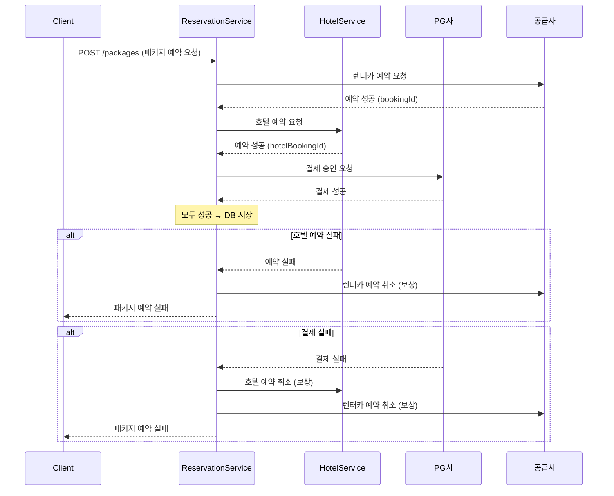
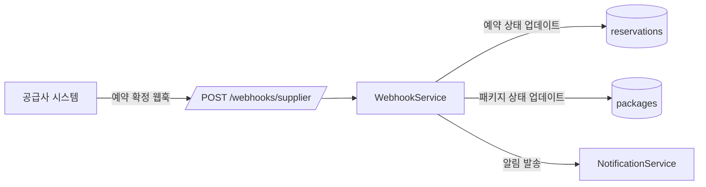

# 예약 성공, 결제 실패 — 분산 트랜잭션 없이 일관성 확보하기

---

패키지 상품 기획이 확정됐을 때, 가장 먼저 든 생각은 그거였다.

"렌터카 예약은 성공했는데 호텔 예약이 실패하면?"

기존 렌터카 예약 흐름은 단순했다. 공급사 API를 호출해 예약을 잡고, 성공하면 PG사 결제를 진행하고, 결제가 완료되면 DB에 기록한다. 모두 같은 서비스 안에서 순차적으로 처리됐다. 문제가 생기면 어디서 터진 건지 알기 어려웠지만, 그래도 단일 도메인이라 어떻게든 수습이 됐다.

호텔을 끼워 넣는 순간 상황이 달라졌다. 두 도메인이 서로 다른 외부 시스템과 통신하는 상황에서 "전부 성공하거나 전부 실패하거나"를 보장하는 건 생각보다 훨씬 복잡한 문제였다.

---

## 예약과 결제가 한 덩어리였다

기존 코드를 보면 이런 식이었다:

```typescript
// 기존: 예약과 결제가 하나의 서비스 메서드에 묶임
async createReservation(dto: CreateReservationDto) {
  // 1. 공급사 예약
  const supplierRes = await this.supplierClient.book(dto);

  // 2. PG 결제 (예약 성공 후 바로 결제)
  const payment = await this.pgClient.charge({
    amount: dto.amount,
    orderId: supplierRes.bookingId,
  });

  // 3. DB 저장 — 예약과 결제를 같은 트랜잭션으로
  return this.db.transaction(async (trx) => {
    await trx.insert('reservations', { ...supplierRes });
    await trx.insert('payments', { ...payment });
  });
}
```

이 구조의 문제는 세 가지였다.

첫째, 장애 원인을 분리할 수 없었다. 결제 실패인지 공급사 예약 실패인지 로그를 뒤져야 알 수 있었다. 둘째, 호텔 도메인을 삽입할 자리가 없었다. 렌터카 예약 성공 → 호텔 예약 → 결제 순서로 가려면 중간에 끼워 넣을 구조가 아니었다. 셋째, 부분 실패 처리가 없었다. 공급사 예약은 됐는데 PG 결제가 실패하면 공급사 예약을 취소하는 로직이 없었다.

---

## 2PC는 처음부터 불가능했다

세 가지 방법을 검토했다.

| 방식 | 설명 | 판단 |
|---|---|---|
| **2PC (2단계 커밋)** | 모든 참여자가 준비 완료 후 일괄 커밋 | PG사·해외 공급사가 미지원. 불가 |
| **사가 오케스트레이터** | 중앙 오케스트레이터가 각 서비스 호출 조율 | 2단계 흐름에 운영 복잡도 대비 이득 적음 |
| **보상 트랜잭션** | 각 단계 성공 후 실패 시 역순으로 취소 | 기존 인프라 위에 REST 웹훅으로 구현 가능 |

2PC는 PG사와 해외 공급사가 XA 트랜잭션을 지원하지 않아 처음부터 제외됐다. 사가 오케스트레이터는 단계가 많아질수록 강력하지만, 지금 흐름은 "예약 → 결제" 2단계가 전부였다. 오케스트레이터를 위한 별도 서비스를 띄우고 상태를 관리하는 비용이 이득보다 크다고 판단했다.

보상 트랜잭션은 단순하다. 각 단계가 성공하면 다음 단계로 진행하고, 실패하면 이미 성공한 단계를 역순으로 취소한다. 외부 시스템이 "취소 API"를 제공하기만 하면 된다. 렌터카 공급사와 PG사 모두 취소 API가 있었다.



---

## 예약·결제 테이블을 분리했다

기존에는 `reservations` 테이블에 결제 정보가 섞여 있었다. 분리했다:

```sql
-- 예약 테이블 (공급사 예약 정보만)
CREATE TABLE reservations (
  id          UUID PRIMARY KEY,
  package_id  UUID,
  type        ENUM('car', 'hotel'),
  supplier_id VARCHAR(50),
  booking_ref VARCHAR(100),   -- 공급사 예약 번호
  status      ENUM('pending', 'confirmed', 'cancelled'),
  created_at  TIMESTAMP
);

-- 결제 테이블 (PG 결제 정보만)
CREATE TABLE payments (
  id             UUID PRIMARY KEY,
  package_id     UUID,
  pg_transaction VARCHAR(100),  -- PG사 거래 번호
  amount         DECIMAL(10,2),
  status         ENUM('pending', 'paid', 'refunded', 'failed'),
  created_at     TIMESTAMP
);
```

이렇게 분리하면 "예약은 됐는데 결제가 안 됐다"는 상황을 DB 쿼리 하나로 파악할 수 있다.

---

## 보상 트랜잭션 구현

핵심은 `compensations` 배열이다. 각 단계가 성공할 때마다 취소 함수를 배열에 쌓아두고, 실패하면 역순으로 실행한다.

```typescript
@Injectable()
export class PackageReservationService {
  async createPackage(dto: CreatePackageDto): Promise<Package> {
    const compensations: Array<() => Promise<void>> = [];

    try {
      // Step 1: 렌터카 예약
      const carBooking = await this.carSupplierClient.book({
        pickupLocation: dto.pickupLocation,
        dropoffLocation: dto.dropoffLocation,
        vehicleId: dto.vehicleId,
      });
      compensations.push(() =>
        this.carSupplierClient.cancel(carBooking.bookingRef)
      );

      // Step 2: 호텔 예약
      const hotelBooking = await this.hotelService.book({
        hotelId: dto.hotelId,
        checkIn: dto.checkIn,
        checkOut: dto.checkOut,
      });
      compensations.push(() =>
        this.hotelService.cancel(hotelBooking.bookingRef)
      );

      // Step 3: 결제
      const payment = await this.pgClient.charge({
        amount: dto.totalAmount,
        orderId: `PKG-${dto.packageId}`,
      });
      compensations.push(() =>
        this.pgClient.refund(payment.transactionId)
      );

      // 모두 성공 → DB 저장
      return await this.db.transaction(async (trx) => {
        await trx.insert('reservations', [
          { packageId: dto.packageId, type: 'car', bookingRef: carBooking.bookingRef, status: 'confirmed' },
          { packageId: dto.packageId, type: 'hotel', bookingRef: hotelBooking.bookingRef, status: 'confirmed' },
        ]);
        await trx.insert('payments', {
          packageId: dto.packageId,
          pgTransaction: payment.transactionId,
          amount: dto.totalAmount,
          status: 'paid',
        });
        return { packageId: dto.packageId, status: 'confirmed' };
      });

    } catch (error) {
      this.logger.error('Package reservation failed, running compensations', error);
      await this.runCompensations(compensations);
      throw new PackageReservationFailedException(error.message);
    }
  }

  private async runCompensations(
    compensations: Array<() => Promise<void>>
  ): Promise<void> {
    for (const compensate of compensations.reverse()) {
      try {
        await compensate();
      } catch (err) {
        // 보상 실패는 로그만 남기고 계속 진행 (수동 처리 대상)
        this.logger.error('Compensation failed — manual intervention required', err);
      }
    }
  }
}
```

보상 자체가 실패하는 경우(공급사 API 장애 등)는 로그를 남기고 수동 처리 대상으로 분류했다. 완전 자동화보다 "실패를 명시적으로 드러내는 것"이 더 중요하다고 판단했다.

---

## 공급사 예약 확정은 실시간이 아니었다

공급사 예약 확정이 실시간으로 오지 않는 경우가 있었다. 예약 요청 후 수 분 내에 확정 웹훅이 오는 구조였다.



```typescript
@Post('/webhooks/supplier/:supplierId')
async handleSupplierWebhook(
  @Param('supplierId') supplierId: string,
  @Body() payload: SupplierWebhookPayload,
  @Headers('x-supplier-signature') signature: string,
) {
  this.webhookService.verifySignature(supplierId, payload, signature);

  await this.reservationService.updateByBookingRef({
    supplierId,
    bookingRef: payload.bookingRef,
    status: this.mapSupplierStatus(payload.status),
  });
}
```

---

## 결과

| 항목 | 이전 | 이후 |
|---|---|---|
| 패키지 상품 | 없음 | **출시 완료** |
| 호텔 매출 비중 | 0% | **60%** |
| 장애 원인 분리 | 로그 수동 추적 | **예약/결제 테이블 분리로 즉시 파악** |
| CS 대응 속도 | 느림 (원인 파악 시간 소요) | **개선 (예약/결제 상태 독립 조회)** |
| 보상 트랜잭션 커버리지 | 없음 | **3단계 전체 (렌터카 예약 → 호텔 예약 → 결제)** |

---

## 분산 시스템에서 완전한 일관성은 환상이다

이 작업에서 가장 중요한 결정은 "2PC를 쓰지 않겠다"가 아니라 "2PC를 쓸 수 없다"는 현실을 인정한 것이었다. 외부 시스템이 지원하지 않는 기술을 억지로 끼워 맞추려 하면 더 복잡한 문제가 생긴다.

보상 트랜잭션은 완벽하지 않다. 보상 자체가 실패할 수 있고, 그 경우 수동 처리가 필요하다. 하지만 `Compensation failed — manual intervention required`가 로그에 찍히는 게 조용히 데이터가 불일치 상태로 남는 것보다 훨씬 다루기 쉽다.

우리가 할 수 있는 건 실패를 빠르게 감지하고, 복구 경로를 명확히 만들고, 실패가 났을 때 어디서 났는지 즉시 알 수 있게 하는 것이다.
