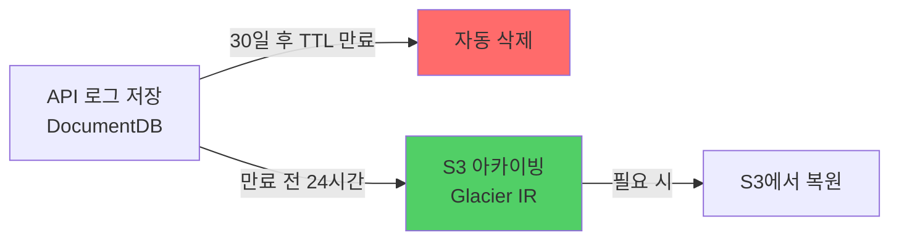
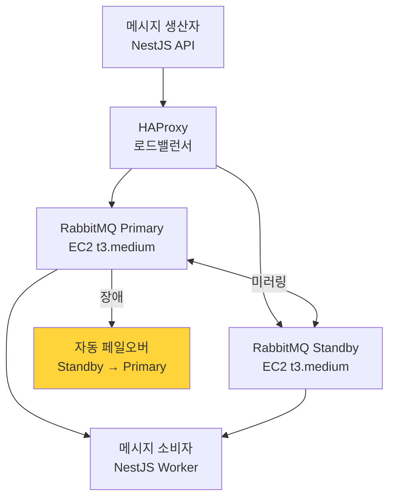

# AWS 인프라 비용 92% 절감 — DocumentDB TTL 아카이빙과 RabbitMQ 전환

---

어느 달 AWS 청구서를 열었다가 손이 멈췄다. 380만 원. 서비스가 성장하고 있으니 비용이 늘어나는 건 당연하다고 생각했는데, 항목을 하나씩 뜯어보니 그게 아니었다.

DocumentDB 스토리지가 계속 불어나고 있었다. 조회는 최근 1개월치만 하는데, 데이터는 서비스 시작부터 전부 쌓여 있었다. AWS MQ는 `mq.m5.large` 3대를 풀로 돌리고 있었는데, 실제 트래픽을 보면 그 절반도 안 쓰고 있었다. 매니지드 서비스의 편의 비용을 내고 있었던 거다.

"이거 줄일 수 있겠는데."

---

## DocumentDB가 왜 이렇게 커졌나

공급사 API 요청/응답 로그를 전수 저장하고 있었다. 예약 조회, 차량 검색, 가격 조회 — 외부 API 호출마다 원본 요청과 응답이 그대로 쌓였다. 응답 하나가 수백 KB인 경우도 있었다.

```
{
  supplierId: "supplier-a",
  endpoint: "/vehicles/search",
  requestBody: { ... },
  responseBody: { ... },  // 수백 KB
  createdAt: "2024-01-15T09:00:00Z"
}
```

디버깅이나 정산 검증에 필요한 데이터였다. 근데 실제로 1년 전 로그를 꺼내 본 적이 한 번도 없었다. 최근 1개월치만 쓰고 있었다. 나머지는 그냥 돈 내면서 보관하고 있던 셈이다.

해결책은 단순했다. 30일 지난 건 지우되, 지우기 전에 S3에 옮겨두면 된다.



TTL 인덱스(Time-To-Live Index)를 걸면 MongoDB/DocumentDB가 알아서 만료된 도큐먼트를 삭제한다. 별도 배치 작업이 필요 없다.

```javascript
// DocumentDB TTL 인덱스 생성
db.api_logs.createIndex(
  { createdAt: 1 },
  { expireAfterSeconds: 30 * 24 * 60 * 60 }  // 30일
);
```

아카이빙은 매일 새벽 2시에 돌리는 스케줄러가 처리한다. TTL 만료 하루 전인 29일치 로그를 S3 Glacier Instant Retrieval(즉시 복원 가능한 저비용 스토리지)에 올린다.

```typescript
@Cron('0 2 * * *') // 매일 새벽 2시
async archiveLogs(): Promise<void> {
  const cutoffDate = subDays(new Date(), 29); // TTL 만료 하루 전

  const oldLogs = await this.logRepo.find({
    createdAt: { $lt: cutoffDate },
  });

  if (oldLogs.length === 0) return;

  const grouped = groupBy(oldLogs, (log) =>
    format(log.createdAt, 'yyyy/MM/dd'),
  );

  for (const [date, logs] of Object.entries(grouped)) {
    const key = `api-logs/${date}/logs-${Date.now()}.json.gz`;
    const compressed = await gzip(JSON.stringify(logs));

    await this.s3Client.send(
      new PutObjectCommand({
        Bucket: 'camoa-log-archive',
        Key: key,
        Body: compressed,
        ContentEncoding: 'gzip',
        StorageClass: 'GLACIER_IR', // 즉시 복원 가능한 Glacier
      }),
    );
  }
}
```

S3 Glacier Instant Retrieval을 고른 이유는 표준 S3보다 80% 저렴하면서 밀리초 단위로 복원할 수 있어서다. 1년 전 로그를 꺼낼 일이 거의 없지만, 만약 필요하면 즉시 꺼낼 수 있다.

| 항목 | 이전 | 이후 |
|---|---|---|
| DocumentDB 스토리지 | 계속 증가 | **30일치만 유지** |
| 월 비용 | 140만 원 | **12만 원** |
| 데이터 유실 리스크 | 없음 | **없음 (S3 아카이빙)** |

---

## AWS MQ를 EC2로 옮기기로 했다

AWS MQ(Amazon MQ)는 RabbitMQ를 매니지드로 제공하는 서비스다. 편리하지만 비싸다. `mq.m5.large` 3대에 월 240만 원이 나갔다.

RabbitMQ 자체는 오픈소스다. EC2에 직접 설치하면 인스턴스 비용만 낸다.

근데 이 결정이 쉽지 않았다. 매니지드 서비스를 EC2로 전환하면 가용성 관리를 직접 해야 한다. AWS MQ는 AWS가 장애를 처리하지만, EC2 RabbitMQ는 우리가 처리해야 한다.

| 항목 | AWS MQ | EC2 RabbitMQ |
|---|---|---|
| 월 비용 | 240만 원 | 18만 원 |
| 관리 부담 | AWS 담당 | 직접 관리 |
| 업그레이드 | 자동 | 수동 |
| 모니터링 | CloudWatch 기본 제공 | 직접 구성 |
| 장애 복구 | AWS SLA | 직접 설계 |

전환을 결정한 근거는 세 가지였다. 첫째, MQ는 예약 이벤트 처리용으로 초당 수백 건 수준이었다. `mq.m5.large` 3대는 과잉 스펙이었다. 둘째, 팀에 RabbitMQ 운영 경험이 있었다. 셋째, 월 220만 원 절감 vs 운영 부담 증가 — 충분히 감수할 수 있는 트레이드오프였다.

단, 전환하면서 가용성을 어떻게 확보할지 먼저 설계했다.



Active-Standby 구성으로 Primary가 다운되면 Standby가 자동으로 역할을 이어받는다. 큐 미러링(Queue Mirroring) 정책으로 두 노드에 메시지를 복제해둔다.

```bash
# RabbitMQ 클러스터 구성 (standby 노드에서)
rabbitmqctl stop_app
rabbitmqctl join_cluster rabbit@primary-node
rabbitmqctl start_app

# 큐 미러링 정책 설정
rabbitmqctl set_policy ha-all ".*" \
  '{"ha-mode":"all","ha-sync-mode":"automatic"}' \
  --priority 0 \
  --apply-to queues
```

---

## 전환하면서 메시지 유실 사고가 났다

AWS MQ에서 EC2로 옮기면서 한 가지 문제가 터졌다. 자동 ack(Auto-Acknowledgement) 설정이 켜져 있던 컨슈머가 메시지를 받자마자 ack를 보내고, 처리 중 실패하면 메시지가 그냥 사라졌다.

```typescript
// 문제가 있던 코드 (자동 ack)
channel.consume(queue, async (msg) => {
  channel.ack(msg);          // 수신 즉시 ack → 처리 실패해도 메시지 사라짐
  await processMessage(msg); // 여기서 실패하면 메시지 유실
});

// 수정된 코드 (수동 ack)
channel.consume(queue, async (msg) => {
  try {
    await processMessage(msg);
    channel.ack(msg);  // 처리 성공 후 ack
  } catch (error) {
    const isRetryable = this.isRetryableError(error);
    channel.nack(msg, false, isRetryable); // 재시도 가능 여부에 따라 분기
  }
}, { noAck: false }); // 수동 ack 모드
```

3회 재시도 후에도 실패하면 DLQ(Dead Letter Queue, 처리 실패 메시지 보관 큐)로 이동한다. DLQ에 쌓인 메시지는 Slack 알림으로 확인하고 수동 처리한다.

```typescript
await channel.assertQueue('reservation-events', {
  durable: true,
  arguments: {
    'x-dead-letter-exchange': 'dlx',
    'x-dead-letter-routing-key': 'reservation-events.dead',
    'x-message-ttl': 24 * 60 * 60 * 1000,
    'x-max-retries': 3,
  },
});
```

모니터링도 직접 구성했다. AWS MQ는 CloudWatch 메트릭이 기본 제공되지만, EC2 RabbitMQ는 Management API를 직접 폴링해야 한다.

```typescript
@Cron('*/5 * * * *') // 5분마다
async checkRabbitMQHealth(): Promise<void> {
  const stats = await this.rabbitmqManagementApi.getQueueStats();

  for (const queue of stats.queues) {
    if (queue.messages_unacknowledged > 100) {
      await this.slackNotifier.alert({
        title: 'RabbitMQ Unacked 메시지 급증',
        message: `큐 ${queue.name}: ${queue.messages_unacknowledged}건 미처리`,
        severity: 'warning',
      });
    }

    if (queue.name.endsWith('.dead') && queue.messages > 0) {
      await this.slackNotifier.alert({
        title: 'DLQ 메시지 발생',
        message: `${queue.name}: ${queue.messages}건`,
        severity: 'error',
      });
    }
  }
}
```

---

## 전체 비용 변화

| 항목 | 이전 | 이후 | 절감 |
|---|---|---|---|
| DocumentDB | 140만 원/월 | 12만 원/월 | **128만 원 (91%)** |
| AWS MQ | 240만 원/월 | 18만 원/월 | **222만 원 (92%)** |
| **합계** | **380만 원/월** | **30만 원/월** | **350만 원 (92%)** |

---

## 비용 절감 제안을 할 때 "얼마 줄어든다"만 말하면 안 된다

DocumentDB TTL은 리스크가 거의 없었다. S3에 아카이빙하면 데이터 유실 없이 비용만 줄어든다. 반면 AWS MQ → EC2 전환은 가용성 리스크가 있었다. Active-Standby 구성, 수동 ack, DLQ, 모니터링을 함께 설계한 이유다.

비용 절감 제안을 팀에 가져갈 때 "월 350만 원 줄어든다"만 말하면 설득력이 없다. "어떤 리스크가 있고, 어떻게 보완할 것인가"를 함께 제시해야 팀이 신뢰하고 진행할 수 있다. 이번 작업에서 가장 중요하게 생각한 건 그거였다 — 비용을 줄이되, 안전하게.
